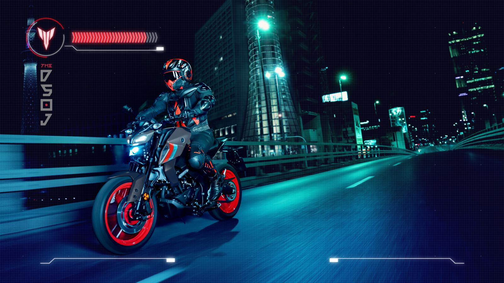
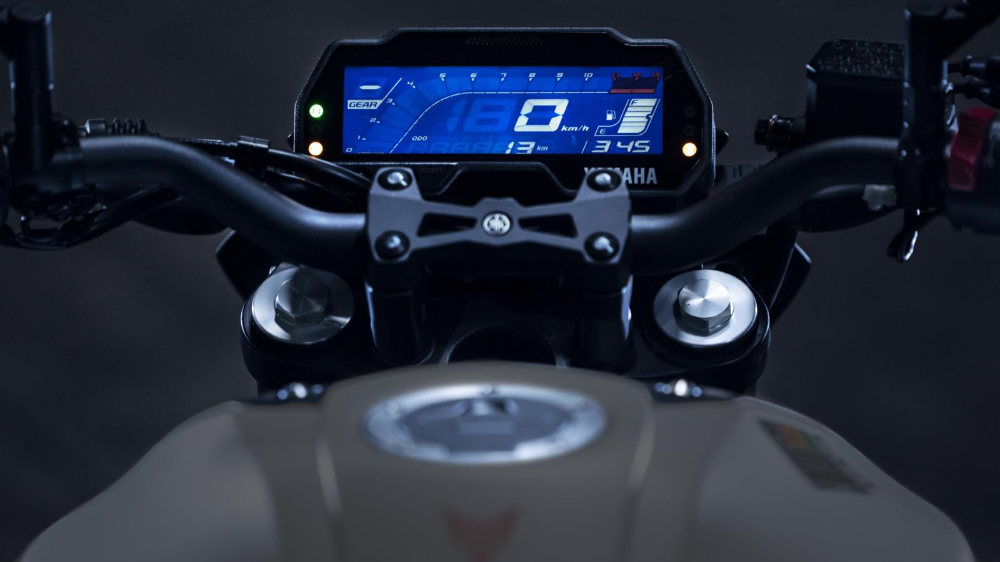
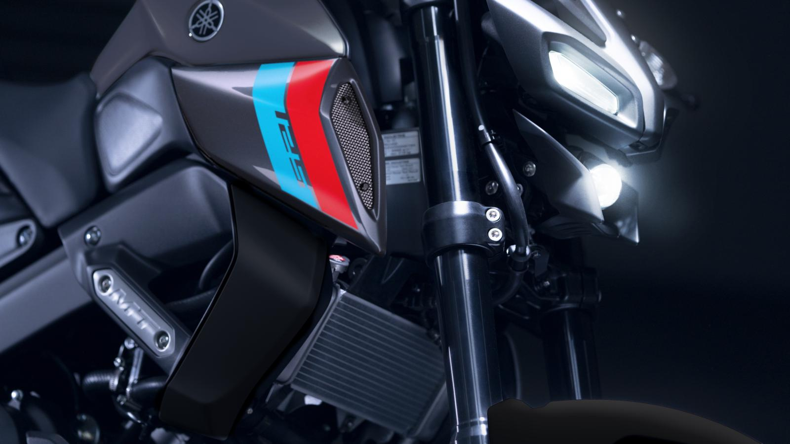
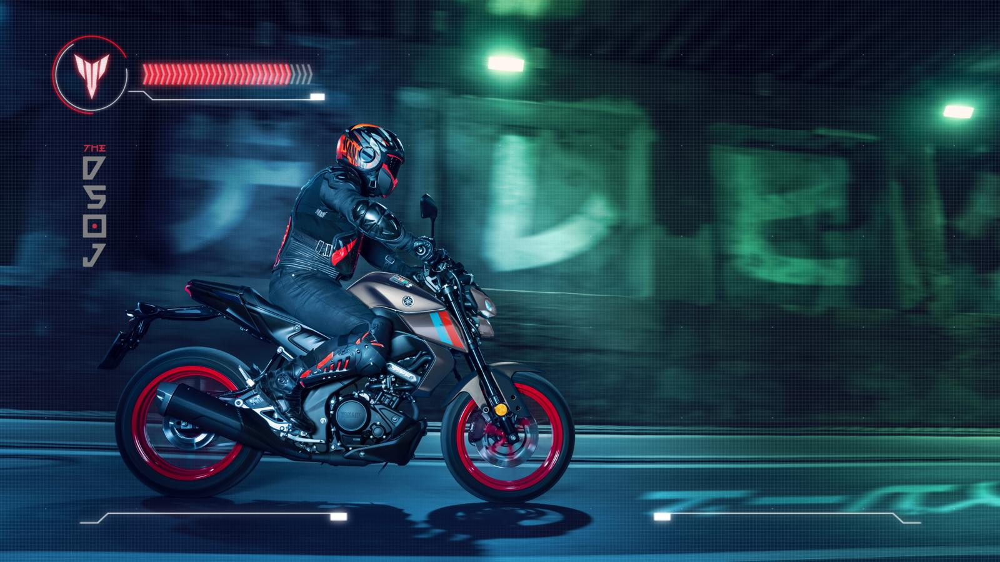
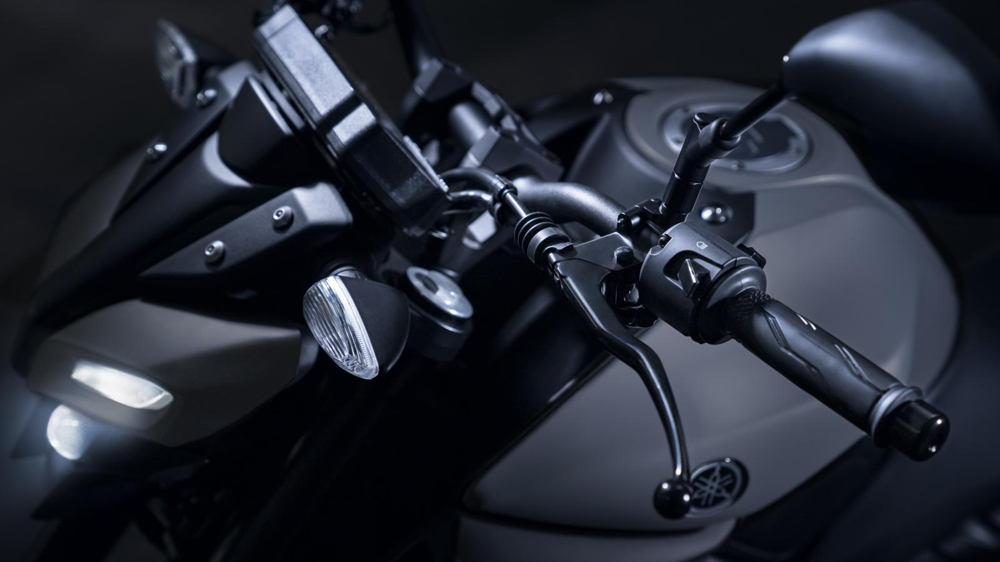

Jest to dość popularny motocykl wśród młodych motocyklistów, ponieważ jest łatwy w prowadzeniu i oferuje dobre osiągi. Dane techniczne Yamahy MT 125 obejmują silnik o pojemności 124,7 cm³ oraz moc 11 kW. Motocykl ma również 6 biegów i waży 140 kg.

## Czy dam sobie radę na motocyklu?

Jeżeli nigdy nie miałeś do czynienia z motocyklami, pierwsze chwile mogą być trudne, nie będę ukrywał. Aczkolwiek mi trudniej było nauczyć się jeździć samochodem niż motocyklem. Głównie ze względu na zrozumienie jak działa sprzęgło i o co chodzi z jego płynnym puszczaniem, żeby pojazd ruszył, nie zgasł i nie szarpał. Te same mechanizmy przełożysz na motocykl.

Zmiany są oczywiście ale mechanizm ten sam. Lewa ręka sprzęgło, lewa stopa zmieniasz biegi. Pierwszy do dołu, pozostałe do góry. MT125 wyświetla biegi w lewym górny rogu swojego monochromatycznego wyświetlacza. Zawsze będziesz miał podgląd czy wbijać czy zbijać bieg.

Teraz pytanie motocykl czy skuter? Jesteś w artykule poświęconym MT 125 więc na odpowiedź odeślemy gdzie indziej skupmy się na tym konkretnym produkcie Yamahy. Dodam tylko, że skutery nie wymagają zmieniania biegów, jeśli myślisz, że sobie z tym nie poradzisz może warto poszukać skutera?

**MT waży 120 kg** także jeśli myślisz, że będzie podobnie jak na rowerze to się mylisz, ile waży Twój rower? 10 kg? Jak przyśpiesza?

Yamaha pozwoli Ci być pierwszym na prawie każdych światłach.

Podsumowując tą część wybierz się do szkoły nauki jazdy i weź kilka godzin jazdy doszkalającej na placu. Nie wydasz zbyt dużo pieniędzy a przekonasz się czy to twoja bajka.

## Czy naked jest dla Ciebie?

Jak możemy zdefiniować motocykl typu naked? Jest to motocykl o sportowym charakterze, bez żadnych osłon i bocznych elementów karoserii. Szeroki rozstaw kół sprawia, że jest to motocykl stabilny i łatwy w prowadzeniu.

Brak osłon to duża ilość powietrza którą dosłownie będziesz musiał przyjąć na klatę, jak zobaczysz niżej prędkość maksymalna nie jest duża więc nie ma dramatu. To połączenie zapewnia komfort, nie oszukujmy się to motocykl do miasta i raczej na dobrą pogodę, brak owiewek to plus. Będzie chłodzić w upalne lato.

MT wygląda drapieżnie jak pozostałe maszyny z tej rodziny. Osobiście przypomina mi postać z Transformersów, ledowe światła wyglądają jak oczy robota. Tym bardziej wzbudzają sympatię.

Co do samych motocykli 125, akurat Yamaha MT125 nie wygląda jak kosiarka z kołami. Koła są węższe ale niewiele niż w większych motocyklach ale hej on na prawdę dobrze wygląda. Tylna opona ma 140 mm a np Honda NC750X ma 160. Opony i rozstaw osi bardzo pozytywnie wpływają na prowadzenie tego motocykla.

## Pozycja za kierownicą

Jest raczej komfortowo im mniej masz wzrostu tym bardziej. Lekkość motocykla sprawia, że osoby najmniejszej postury spokojnie sobie z nim poradzą.

Jesteśmy lekko pochyleni do przodu, siedzenie jest raczej twarde, a podnóżki wysoko. Jak to najkrócej podsumować? Nie będzie tak wygodnie jak na turystyku - które swoją drogą w tej pojemności nie występują, czy cruisserze ale dużo wygodniej niż na ścigaczu Yamaha R125.

### Yamaha mt 125 jaki wzrost może mieć motocyklista, żeby komfortowo się na niej czuć?

Wzrost motocyklisty nie powinien przekraczać 190 cm. Przy takim wzroście swobodnie sobie na nim pojeździcie, dlaczego? Porównajmy go do większego brata MT07 - motocykl egzaminacyjny na kat. A.
<table border="1">
    <tbody>
        <tr>
            <th></th>
            <th>MT 125</th>
            <th>MT 07</th>
            
            
        </tr>    
        <tr>
            <td>wysokość kanapy</td>
            <td>810 mm</td>
            <td>805 mm</td>
        </tr>
        <tr>
            <td>szerokość</td>
            <td>800 mm</td>
            <td>780 mm</td>
        </tr>
        <tr>
            <td>rozstaw kół</td>
            <td>1325 mm</td>
            <td>1400 mm</td>
        </tr>
    </tbody>
</table>

Różnice pomiędzy motocyklem od którego warto zacząć przygodę z jednośladami, a MT-07 są znikome. Jeśli więc zastanawiasz się, czy to dobry wybór na początek lub czy nie będziesz za duży?

To odpowiedź brzmi do 190 cm wzrostu MT-125 będzie ok. Wymiary jak widać nie odbiegają od dużo potężniejszej siedemsetki MT 07.

Przy okazji komfortu warto wspomnieć, że **moto jest jednooosbowe**. Jak spojrzycie na tył uświadomicie sobie, że nikt nie chciałby, żebyście go przewieźli tą sto-dwudziesto piątką. Nie ma tam najzwyczajniej w świecie miejsca. A komfort dla pasażera będzie mniej więcej taki jakby jechał na drewnianej desce.

Skrzynia biegów jest bardzo dobrze zestrojona, wybacza nieco błędów - ważna rzecz dla tych z was którzy zaczynają przygodę z jednośladami. Zmienianie wychodzi swobodnie i precyzyjnie. Dla niektórych to będzie plus dla innych minus. Jeśli masz w sobie odrobinę sportowego zacięcia, zmienianie biegów to duża radocha, wbijasz kolejny bieg i odkręcasz. Automatycznie banan na twarzy gwarantowany, przynajmniej ja tak mam.

Yamaha nie pożałowała na hamulcach, mamy jedną tarczę ale hello on waży jedynie 140 kg, mocny radialny 4-tłoczkowy zacisk i tarcza 292 mm robi robotę.

## Osiągi modelu Yamaha 125 mt

### Prędkość maksymalna

Motocykla Yamaha MT 125 to 125 km/h.

### Przyśpieszenie

Motocykl rozpędza się od 0 do 100 km/h w ciągu 10,5 sekundy. O ile ten wynik nie robi na nikim wrażenia to znacznie lepiej radzi sobie z ruszaniem spod świateł. W większości przypadków będziecie pierwsi. Nie rekompensujemy tu sobie jakiś naszych braków czy kompleksów, bycie pierwszym na światłach to po prostu kwestia bezpieczeństwa.

Wspomnę tylko, że MT125 jest bardzo elastyczny i czasami nawet nie ma sensu redukować biegu, poradzi sobie z przyśpieszeniem tak samo dobrze z wyższym.

## Ile kosztuje Yamaha MT 125

Cena nowej Yamahy MT 125 wynosi około **23 500 złotych**. Dużo? Policzmy sobie jednak ile będzie Cię kosztować utrzymanie tego motocykla, a zobaczysz ile możesz zaoszczędzić.

Po pierwsze spalanie - **2 litry na 100 km**. Wynik nie do pobicia dla żadnego samochodu.

**Ubezpieczenie motocykla to grosze** w przypadku pojemności 125 cm3. Tu korzystamy z nieświadomości ubezpieczycieli, ta mała "bzykawka" poleci przecież ponad setkę! Szkody w przypadku gleby czy szlifa będą kosztowały sporo prawdopodobnie tyle co motocykl lub co najmniej 50% jego wartości. Na szczęście mała pojemność w oczach ubezpieczyciela to małe zagrożenie, co za tym idzie mało zapłacisz.

**Serwis** również **nie będzie** zbyt **kosztowny**, co prawda Yamaha ma swoją renomę ale nie jest to marka premium - będzie przystępnie.

Dojedziesz do pracy szybciej niż samochodem, bez problemu przeciśniesz się między samochodami - zaoszczędzisz czas, a jak wiadomo to pieniądz.

Parkowanie w centrum - bezpłatnie, na szczęście jeszcze nie przyszło włodarzom miast kasowanie motocyklistów czy osób na skuterach za parkomaty. Ostatnie ale nie mniej ważne prawo jazdy, nie musisz się ubiegać o dodatkowe uprawnienia. **Motocykl Yamaha MT 125 poprowadzisz na kategorię B** - tak jak samochód. A to oszczędność nawet 2000 zł.

Podsumuj powyższe i okaże się, że zwrot z tej inwestycji może być bardzo szybki.

## Yamaha mt-125 co ile wymiana oleju?

Producent zaleca wymianę oleju w motocyklu Yamaha MT 125 co 5000 km.

Pojemność miski olejowej w motocyklu Yamaha MT 125 wynosi 1 litr. Olej, który należy używać to 10W40.

## Dane techniczne
### Silnik
<table border="1">
<tbody>
<tr>
<td >Typ silnika</td>
<td >EURO5, 4-suwowy, Chłodzony cieczą, SOHC, Jednocylindrowy</td>
</tr>
<tr>
<td >Pojemność</td>
<td >

124 cm3

</td>
</tr>
<tr>
<td >Moc maksymalna</td>
<td >

11,0 kW przy 10000 obr./min

</td>
</tr>
<tr>
<td >Maksymalny moment obrotowy</td>
<td >

11,5 Nm przy 8000 obr./min

</td>
</tr>
<tr>
<td>Skrzynia biegów</td>
<td>

Z kołami w stałym zazębieniu, 6-biegowa

</td>
</tr>
<tr>
<td>Spalanie</td>
<td>

2.1 L/100 km

</td>
</tr>
</tbody>
</table>

### Podwozie
<table border="1">
<tbody>
<tr >
<td>Kąt wyprzedzania główki ramy</td>
<td>26º</td>
</tr>
<tr >
<td>Wyprzedzenie</td>
<td>95 mm</td>
</tr>
<tr >
<td>Układ przedniego zawieszenia</td>
<td>Widelec teleskopowy upside-down, Ø 41 mm</td>
</tr>
<tr >
<td>Układ tylnego zawieszenia</td>
<td>Wahacz, (Link type suspension)</td>
</tr>
<tr >
<td>Skok przedniego zawieszenia</td>
<td>130 mm</td>
</tr>
<tr >
<td>Skok tylnego zawieszenia</td>
<td>110 mm</td>
</tr>
<tr >
<td>Hamulec przedni</td>
<td>Hydrauliczny z pojedynczą tarczą Ø 292 mm</td>
</tr>
<tr >
<td>Hamulec tylny</td>
<td>Hydrauliczny z pojedynczą tarczą Ø 220 mm</td>
</tr>
<tr >
<td>Opona przednia</td>
<td>100/80-17M/C 52S</td>
</tr>
<tr >
<td>Opona tylna</td>
<td>140/70-17M/C 66S</td>
</tr>
</tbody>
</table>

### Wymiary
<table border="1">
<tbody>
<tr >
<td>Długość całkowita</td>
<td>1960 mm</td>
</tr>
<tr >
<td>Szerokość całkowita</td>
<td>800 mm</td>
</tr>
<tr >
<td>Wysokość całkowita</td>
<td>1065 mm</td>
</tr>
<tr >
<td>Wysokość kanapy</td>
<td>810 mm</td>
</tr>
<tr >
<td>Rozstaw kół</td>
<td>1325 mm</td>
</tr>
<tr >
<td>Minimalny prześwit</td>
<td>160 mm</td>
</tr>
<tr >
<td>Masa z obciążeniem (wliczając wypełnione zbiorniki oleju i paliwa)</td>
<td>142 kg</td>
</tr>
<tr>
<td >Pojemność zbiornika paliwa</td>
<td >11 litrów</td>
</tr>
<tr>
<td >Pojemność zbiornika oleju</td>
<td >1,05 litra</td>
</tr>
</tbody>
</table>

## Podsumowanie

Jest to motocykl, nie skuter, więc musisz się pogodzić z koniecznością zmiany biegów. Te jak wskazałem wyżej wchodzą z łatwością i jeśli masz trochę sportowego zacięcia będzie to dla ciebie tylko i wyłącznie frajda. Duży plus to spalanie najniższe jakie można sobie wyobrazić a co za tym i koszty utrzymania.

Minus to cena wejściowa, to Yamaha więc nie jest najtańsza ale nie jest też marką premium są droższe. Motocykl jest elastyczny i wygodny, dobrze przyśpiesza i sprawia dużo radości. Warto na poważnie rozważyć ten wybór zaczynając przygodę z pojemnościami silnika na kategorię B.