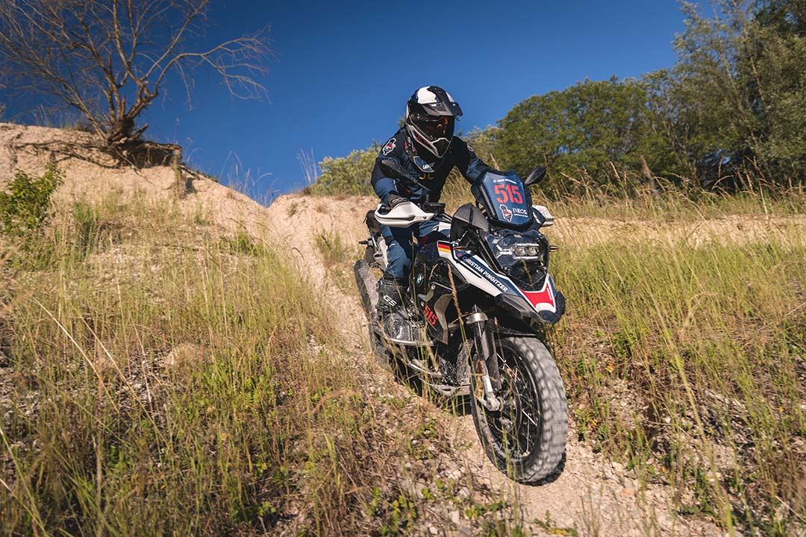

## Najwyższa siła ciągu i moc oraz niestandardowe wyposażenie dla wymagających przygód w najtrudniejszym terenie.

Podczas gdy **BMW F 850 GS** był używany jako motocykl konkursowy podczas ostatniego International GS Trophy w 2020 r., BMW Motorrad powraca do rywalizacji z modelem **R 1250 GS Trophy Competition** wyposażonym w silnik typu **boxer flat-twin**. Oferuje potężną dawkę mocy, solidny moment obrotowy i maksymalną trakcję na niekiedy bardzo wymagających przejściach terenowych, które często wymagają jazdy na niskim biegu. Oprócz ekskluzywnego dwutonowego lakieru _Lightwhite / Gravityblue metallic matt_ w połączeniu ze specjalnie zaprojektowanymi **naklejkami GS Trophy**,

R 1250 GS Trophy Competition wyrusza na siedmiodniową przygodę z całą serią zmian wprowadzonych specjalnie na potrzeby tego konkursu. W roku modelowym **2023 R 1250 GS będzie również oferowany w tym dwutonowym lakierz**.

Na przykład tegoroczny **motocykl BMW International GS Trophy Competition** posiada m.in.
- solidną aluminiową osłonę silnika enduro,
- osłonę reflektora, 
- szczególnie dobrze chronione przed uszkodzeniami pokrywy głowicy cylindrów oraz 
- wyświetlacz TFT zabezpieczony przed uszkodzeniem podczas upadku i przed spadającymi kamieniami.

Szczególnie **solidne podnóżki enduro** z modelu R 1250 GS Adventure oraz **regulowane dźwignie zmiany biegów i hamulca nożnego** równie dobrze pasują do czekającego motocykle trudnego użytkowania w terenie. Na szprychowanych kołach zamontowano opony Metzeler Karoo 4, które zastąpiły standardowe opony Karoo 3, aby zapewnić jeszcze lepszą przyczepność w trudnym terenie. Sportowa owiewka, rajdowe siedzenie i tylny tłumik Akrapovic dopełniają wyposażenia zawodniczego pojazdu.

## Mała torba Tank Bag Adventure Collection jako praktyczny towarzysz podczas długich wyczerpujących dni jazdy.

Dzięki pojemności **5 litrów**, mała torba na zbiornik z **nowej kolekcji Adventure Bag** oferuje uczestnikom International GS Trophy kolejną praktyczną opcję przechowywania wszelkiego rodzaju przyborów oraz jedzenia i napojów na drogę. Dzięki zapięciom może być używana jako torba tylna w motocyklu R 1250 GS Trophy Competition. Wodoodporna torba wewnętrzna, wodoodporne i zamykane dwukierunkowe zamki błyskawiczne w komorze głównej, kieszeń w pokrywie zapinana na zamek błyskawiczny oraz otwór na kabel do ładowania do wnętrza to kolejne przydatne szczegóły torby Small Adventure Collection Tank Bag.

Wszystko o tegorocznym BMW Motorrad International GS Trophy 2022 w Albanii znajdziesz na stronie <a target="_blank" rel="noreferrer noopener" href="https://www.bmw-motorrad.pl/pl/experience/gs-trophy-2022.html">www.gstrophy.com</a>.

A tu znajdziesz nasz test poprzednika w wersji [BMW R 1250 GS HP](https://mototrips.pl/moto-test/bmw-r-1250-gs-rocznik-2020-wersja-hp-recenzja-w-trasie/)

<iframe width="100%" height="315" src="https://www.youtube.com/embed/4Bi5qtWvrDc" title="YouTube video player" frameborder="0" allow="accelerometer; autoplay; clipboard-write; encrypted-media; gyroscope; picture-in-picture" allowfullscreen></iframe>

