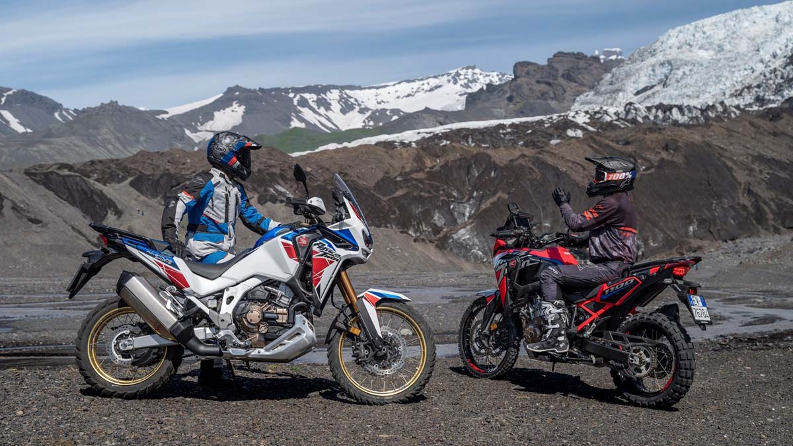
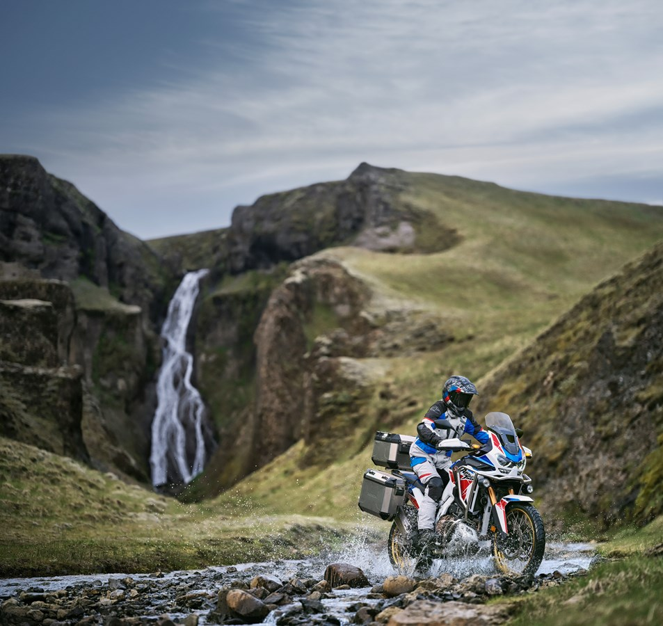

## Od Reykjaviku po Kirkjubæjarklaustur
Trasa wycieczki rozpoczęła się w Reykjaviku i wiedzie między innymi przez Hellę i Geysir do położonego na Północy Husaviku, a następnie prowadzi z powrotem na Południe, przez Hrauneyjar i położone na południowym wschodzie, malownicze Kirkjubæjarklaustur.

Uczestnicy podróżują różnymi wersjami modelu Africa Twin, który podczas Islandzkiej wyprawy ma dowieść niezrównanego poziomu uniwersalności. Znana z niezwykle korzystnej relacji mocy do masy i solidnych możliwości terenowych maszyna pozwala na uatrakcyjnienie długich wycieczek prawdziwymi wyzwaniami, zamieniając spokojne podróżowanie w prawdziwą przygodę.

Wrażenia z tej wyjątkowej wyprawy będą pojawiać się na kanałach społecznościowych Honda Polska. My zbieramy je na specjalnej playliście naszego kanału dostępna poniżej:

<iframe width="560" height="315" src="https://www.youtube.com/embed/videoseries?list=PLxf_KmOMvRzzAvXpanbkNMRbBF7yEea-F" title="YouTube video player" frameborder="0" allow="accelerometer; autoplay; clipboard-write; encrypted-media; gyroscope; picture-in-picture" allowfullscreen></iframe>

## Afryka o dwóch twarzach

Africa Twin to flagowy Adventure Hondy, który wrócił do europejskiej oferty w 2016 roku, po kilkunastu latach przerwy w produkcji. Jest to motocykl niezwykle wszechstronny, zaawansowany technicznie i kochany przez swoich właścicieli, którzy w całej Europie tworzą wyjątkową, wierną marce Honda społeczność połączoną zamiłowaniem do pełnych wyzwań, dalekich podróży.

Model oferowany jest w dwóch głównych odmianach – podstawowej, dedykowanej do jazdy **Enduro oraz Adventure Sports**, zapewniającej więcej udogodnień pod kątem długiego podróżowania z wypadami w teren, dostępnej w opcji z elektronicznie sterowanym zawieszeniem Showa EERA™. Obie odmiany modelu – opcjonalnie – oferowane są również z dwusprzęgłową przekładnią DCT.

**Africę Twin** wyposażono w pełen zestaw elektroniki, wykorzystujący sześcioosiowy bezwładnościowy moduł pomiarowy IMU, który zarządza trybami jazdy i systemem HSTC, a także układem ABS w czasie pokonywania zakrętów, kontrolą unoszenia przedniego koła podczas przyspieszania, kontrolą unoszenia tylnego koła podczas hamowania i funkcją wykrywania zakrętów w wersji z przekładnią DCT.

W standardzie Africa Twin otrzymała podwójne światła LED do jazdy dziennej (DRL) z doświetlaniem zakrętów, kolorowy ekran dotykowy TFT o przekątnej 6,5 cala z Apple CarPlay®, Android Auto® i łącznością Bluetooth, tempomat, podgrzewane manetki, a także gniazda USB i ładowania ACC 12V.

Na lokalnym rynku Honda prowadzi kampanię „Wybierz swój styl”, zgodnie z którą klienci mogą dobrać odmianę modelu Africa Twin do swoich upodobań i skorzystać z oferty wyprzedaży rocznika 2021.

Recenzje tych modeli znajdziecie tutaj: [Honda Afryka Twin](https://mototrips.pl/moto-test/honda-africa-twin-2018-opinia-wrazenia-jazda-testowa/) model z 2018 roku.
[Nowa Honda Afryka Twin Adventure Sports](https://mototrips.pl/moto-test/nowa-honda-afryka-twin-adventure-sport-crf1100l/)

_Informacja prasowa_
