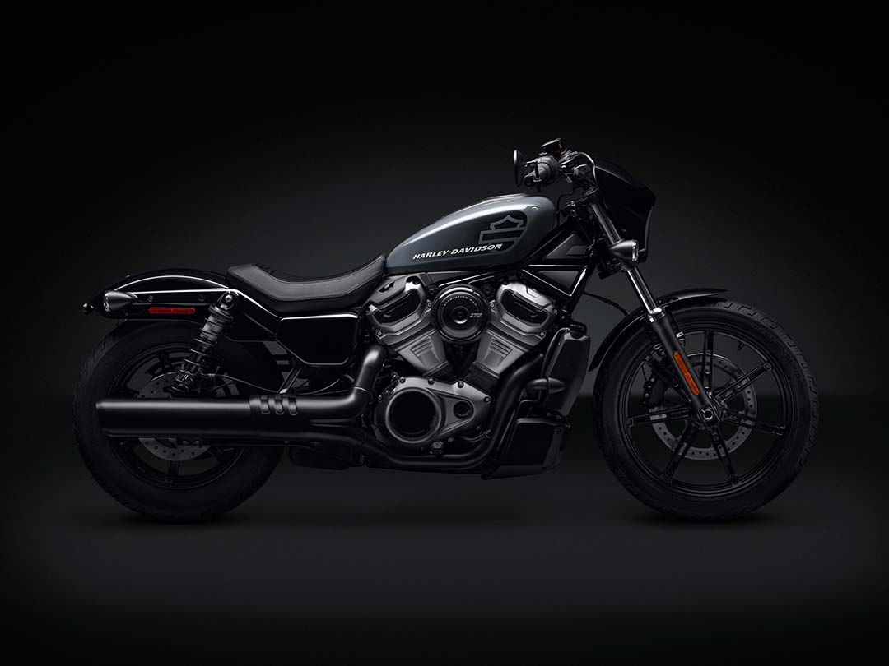
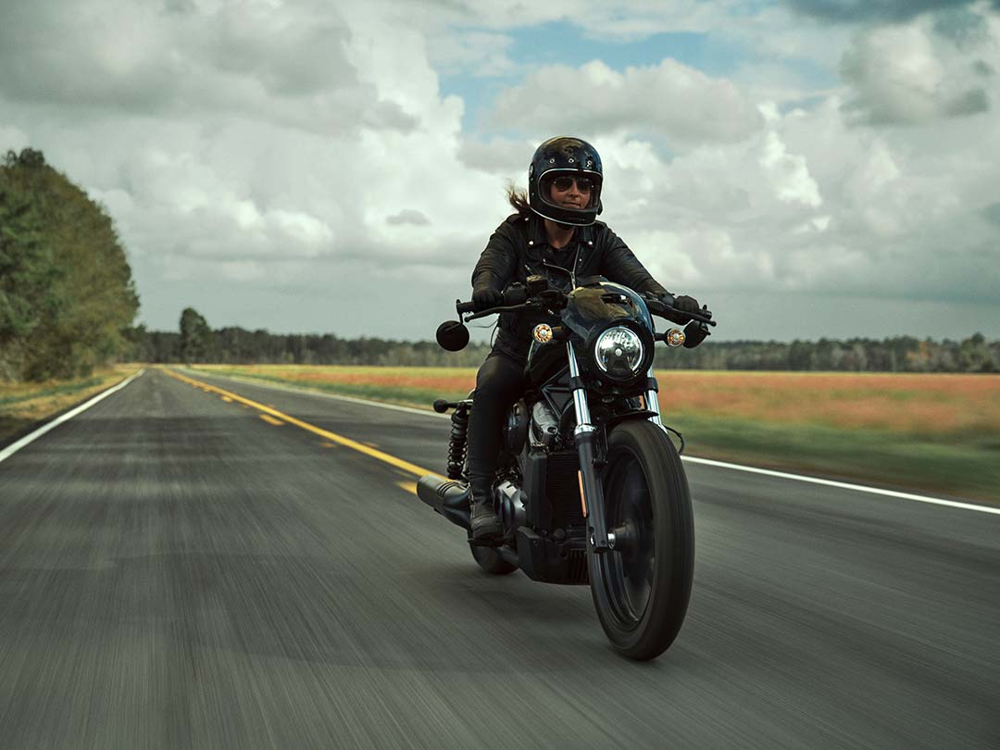
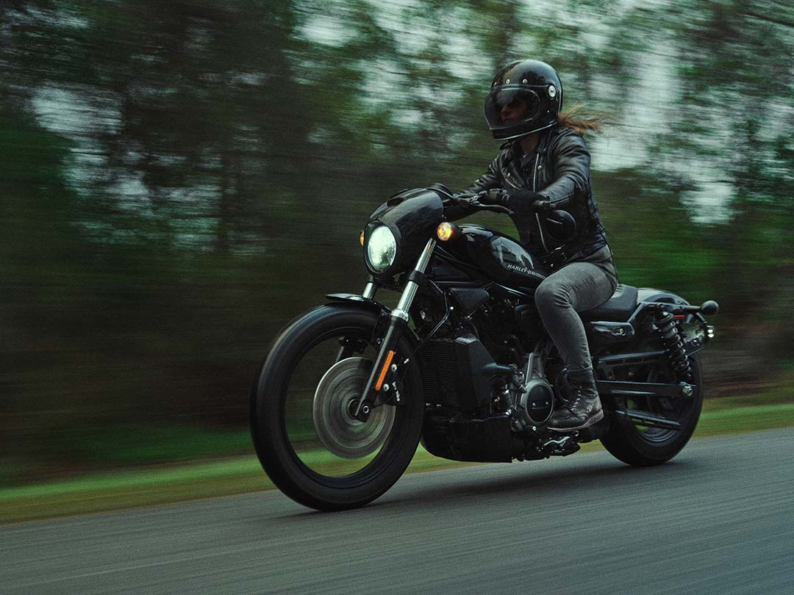
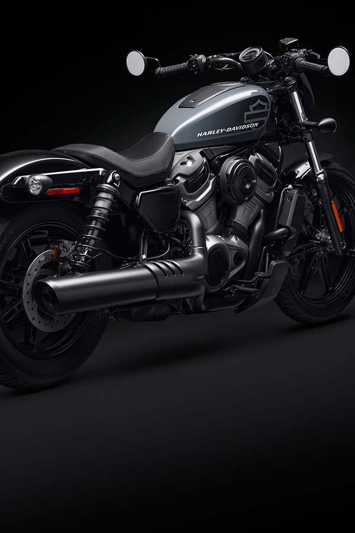
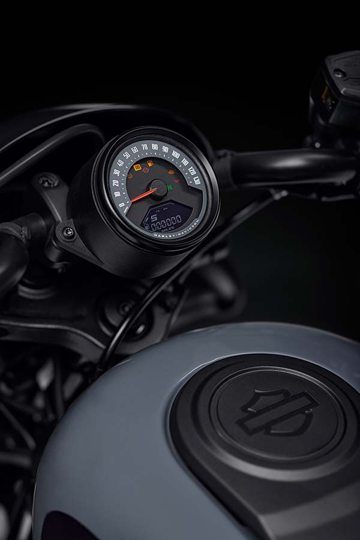

> "Nightster to oparte na osiągach, prawdziwe narzędzie do ekspresji i eksploracji" – powiedział Jochen Zeitz, prezes i dyrektor generalny Harley-Davidson - "Korzystając z 65 lat dziedzictwa Sportster, model Nightster jest jak czyste płótno dla kreatywności, oferując najlepszą platformę do personalizacji i wyrażenia siebie dla nowych i obecnych motocyklistów”.

## Nowy układ napędowy Revolution™ Max 975T
Sercem modelu Nightster jest nowy układ napędowy **Revolution™ Max 975T**, chłodzony cieczą silnik w układzie V o kącie rozwarcia cylindrów 60-stopni, z krzywą momentu obrotowego, która pozostaje płaska w szerokim zakresie - osiągi silnika zaprojektowano z myślą o zapewnieniu zdecydowanego przyspieszenia i solidnej mocy w średnim zakresie obrotów. Długość i kształt kanałów wlotowych dolotu, w połączeniu z objętością komory powietrznej, zostały dostrojone do maksymalizacji osiągów w całym zakresie prędkości obrotowych silnika. Wydajność silnika podnoszą też specjalnie dla niego zaprojektowane profile wałków rozrządu i układ zmiennych faz rozrządu.

### Silnik Revolution™ Max 975T
- Pojemność: 975 cm3
- Moc maksymalna: 89KM (66 kW) @7500 obr./min
- Maksymalny moment obrotowy: 95 Nm @ 5750 obr./min
- Średnica cylindra 97 mm x Skok tłoka 66 mm
- Stopień sprężania 12:1

<iframe width="100%" height="315" src="https://www.youtube.com/embed/nFK-hkaZ3BA" title="YouTube video player" frameborder="0" allow="accelerometer; autoplay; clipboard-write; encrypted-media; gyroscope; picture-in-picture" allowfullscreen></iframe>

Hydrauliczna regulacja luzów zaworowych zapewnia cichą pracę i eliminuje potrzebę skomplikowanego, kosztownego serwisu. Wewnętrzne balansery redukują wibracje silnika, zwiększając komfort kierowcy i trwałość pojazdu. Balansery są dostrojone tak, aby utrzymać wibracje na tyle, żeby czuć kiedy silnik jest uruchomiony.

## Moc i zwinność
Nightster™ łączy zwinne, lekkie podwozie z mocnym silnikiem zestrojonym pod kątem wysokich osiągów w średnim zakresie obrotów. Jest to idealna kombinacja do przedzierania się przez gęstwinę zatłoczonych ulic i ostrej jazdy na krętych bocznych drogach. Centralnie montowane podnóżki i nisko zawieszona kierownica zapewniają wygodną pozycję do jazdy. **Nisko zawieszone siodło - na wysokości 705 mm** - pozwala większości kierowców pewnie postawić stopy na nawierzchni podczas postoju na światłach lub na parkingu.

### Układ napędowy Revolution™ Max 975T
Jest centralnym, strukturalnym elementem podwozia motocykla Nightster™. Wyeliminowanie tradycyjnej ramy znacznie zmniejsza masę maszyny i zapewnia bardzo sztywne podwozie. Konstrukcja tylnej sekcja jest wykonana z lekkiego aluminium. Wahacz jest wykonany ze spawanych prostokątnych rur stalowych i jest punktem mocowania tylnych amortyzatorów.

### Zawieszenie Harley Nightster
Przednie zawieszenie to konwencjonalny **41 mm widelec SHOWA® typu Dual Bending Valve**, zaprojektowany w celu zapewnienia lepszych właściwości jezdnych poprzez utrzymywanie kontaktu opony z nawierzchnią drogi. **Tylne zawieszenie** to **dwa zewnętrzne amortyzatory emulsyjne ze sprężynami śrubowymi i gwintowanym kołnierzem do regulacji wstępnego obciążenia**.

## Systemy zwiększające bezpieczeństwo jazdy

Model Nightster jest wyposażony w systemy zwiększające bezpieczeństwo kierowcy* firmy Harley-Davidson, zbiór technologii zaprojektowanych, by wspierać kierowcę w nieoczekiwanych sytuacjach lub podczas jazdy w niesprzyjających warunkach drogowych poprzez dostosowywanie osiągów motocykla do dostępnej przyczepności podczas przyspieszania, zwalniania i hamowania. Te elektroniczne systemy wykorzystują najnowsze układy sterowania podwoziem, hamulcami i pracą układu napędowego.

- **Układ ABS** ma za zadanie zapobiegać blokowaniu się kół w trakcie hamowania oraz pomaga kierowcy zachować kontrolę podczas hamowania w nagłych sytuacjach na prostej drodze. ABS działa niezależnie na przedni i tylny hamulec, aby utrzymać koła w ruchu i zapobiec niekontrolowanemu blokowaniu się kół.
- **System kontroli trakcji (TCS)** ma na celu zapobieganie nadmiernemu poślizgowi tylnego koła podczas przyspieszania. TCS zwiększa pewność kierowcy, gdy przyczepność jest ograniczona z powodu złej pogody lub nagłej, nieprzewidzianej zmiany nawierzchni bądź jazdy po nieutwardzonej drodze. Kierowca może wyłączyć TCS w dowolnym trybie jazdy, gdy motocykl jest zatrzymany, a silnik pracuje.
- **System kontroli poślizgu (DSCS)** został zaprojektowany w celu dostosowania momentu obrotowego silnika i zmniejszenia nadmiernego poślizgu tylnego koła podczas hamowania wywołanego przez układ napędowy, które zwykle występuje, gdy kierowca gwałtownie wrzuci niższy bieg lub szybko zamknie przepustnicę podczas jazdy na mokrej lub śliskiej nawierzchni.

## Tryby jazdy
Motocykl Nightster oferuje trzy tryby jazdy, które elektronicznie sterują charakterystyką osiągów motocykla i poziomem interwencji technologicznej. Każdy tryb jazdy posiada określoną kombinację ustawień oddawania mocy, hamowania silnikiem, ABS i TCS. Kierowca może użyć przycisku MODE na przełącznikach po prawej stronie, aby zmienić aktywny tryb jazdy podczas jazdy motocyklem lub podczas postoju, z pewnymi wyjątkami. Po wybraniu trybu jazdy na wyświetlaczu pojawia się jego unikatowa ikona.

- **Tryb Road (Droga)** jest przeznaczony do codziennego użytku i zapewnia zrównoważone osiągi. Tryb ten oferuje mniej agresywną reakcję przepustnicy i mniejszą moc silnika w średnim zakresie obrotów niż tryb Sport, przy wyższym poziomie ingerencji układów ABS i TCS.
- **Tryb Sport (Sport)** zapewnia kierowcy **najsilniejszą relację z motocyklem**, dostarczając bezpośrednich i emocjonujących wrażeń z jazdy. Kierowca może w pełni wykorzystać potencjał maszyny w bezpośredni i precyzyjny sposób, mając do dyspozycji pełną moc oraz najszybszą reakcję przepustnicy. Układ **TCS jest ustawiony na najniższy poziom** ingerencji, a **hamowanie silnikiem jest mocniejsze**.
- **Tryb Rain (Deszcz)** został zaprojektowany, aby dać kierowcy większą pewność podczas jazdy w deszczu lub innych warunkach ograniczonej przyczepności. Reakcja przepustnicy i moc wyjściowa są zaprogramowane tak, aby znacznie ograniczyć tempo przyspieszania i siłę hamowania silnikiem. **Ustawione są również najwyższe poziomy ingerencji układów ABS i TCS**.

**Lekka komora na paliwo z tworzywa sztucznego** znajduje się pod siedzeniem i ma pojemność **11,7 litra** – to, co wydaje się być tradycyjnym zbiornikiem paliwa **przed siedzeniem, jest stalową osłoną airbox'a**. Wlew paliwa jest dostępny po odblokowaniu i podniesieniu zamontowanego na zawiasie siodła. **Umieszczenie zbiornika paliwa pod siedzeniem pozwoliło zoptymalizować pojemność komory powietrznej i sprawia też, że środek ciężkości jest niżej**, dzięki czemu motocykl wydaje się jeszcze lżejszy i zwrotniejszy.

**Nightster™** jest wyposażony w zamontowany na wsporniku kierownicy **okrągły, analogowy prędkościomierz o średnicy 4 cali z wbudowanym wielofunkcyjnym wyświetlaczem LCD**. Motocykl ma wszystkie światła w technologii LED, które podkręcają styl oraz sprawiają, że kierowca więcej widzi i jest również bardziej widoczny dla innych użytkowników na drodze. Reflektor przedni LED Daymaker™ zaprojektowaliśmy tak, by generował jednolite źródło światła eliminujące rozpraszające refleksy.

## Świeże wzornictwo oparte na klasycznej formie
Całkowicie nowy, od koła do koła, o smukłym, niskim i zawadiackim wyglądzie, model Nightster hołduje klasycznej stylistyce Sportster odsłoniętymi tylnymi amortyzatorami i kształtem obudowy komory powietrznej, który nawiązuje do kultowego zbiornika paliwa Sportster w kształcie orzecha. Okrągła obudowa filtra powietrza, jednoosobowe siedzenie, ścięte błotniki i mała owiewka przypominają elementy ostatnich modeli Sportster, podczas gdy boczna osłona, która ukrywa zbiornik paliwa pod siedzeniem, ma kształt podobny do poprzedniego zbiornika oleju w modelach Sportster. Centralnym elementem projektu jest układ napędowy Revolution Max, otoczony wijącymi się rurami wydechowymi i wykończony teksturowanym lakierem proszkowym Metallic Charcoal z wstawkami w kolorze Gloss Black. W komplecie felgi w kolorze Satin Black. Motocykl jest dostępny w kolorze Vivid Black, Gunship Grey oraz Redline Red. Lakier w kolorze Gunship Grey i Redline Red jest nakładany tylko na atrapę zbiornika paliwa, błotniki oraz owiewka są pokryte kolorem Vivid Black.

Dział Harley-Davidson® Genuine Motor Parts & Accessories stworzył gamę akcesoriów do motocykla Nightster, zaprojektowanych z myślą o możliwości lepszego dopasowania, zwiększenia komfortu i nadania maszynie własnego stylu.

## Harley Nightster - cena
Model Nightster trafi do autoryzowanych dealerów Harley-Davidson® na całym świecie w kwietniu 2022 roku. Sugerowana cena producenta to **15 760 EUR** dla motocykla w kolorze Vivid Black i **16 050 EUR** dla opcji kolorystycznych.

*Uwaga! Dostępna trakcja jest określana przez interfejs droga/opona. Systemy są w stanie regulować ciśnienie w układzie hamulcowym lub moment obrotowy układu napędowego, w celu zrównoważenia sił działających na opony, aby nie przekroczyć dostępnej przyczepności. Technologie te nie mają możliwości zwiększenia przyczepności, ani nie będą interweniować, gdy kierowca nie wykorzysta hamulca lub przepustnicy (np. jazda w zakręcie z wciśniętą dźwignią sprzęgła). Systemy nie mają też możliwości bezpośredniego wpływania na kierunek poruszania się pojazdu. Jest to kluczowa różnica między systemami w motocyklach a systemami używanymi w samochodach. Kierowca jest ostatecznie odpowiedzialny za prowadzenie i korekcję kierunku jazdy.

*Informacja prasowa*