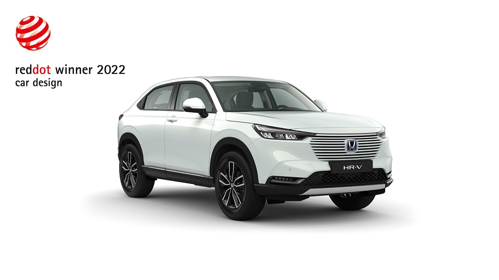
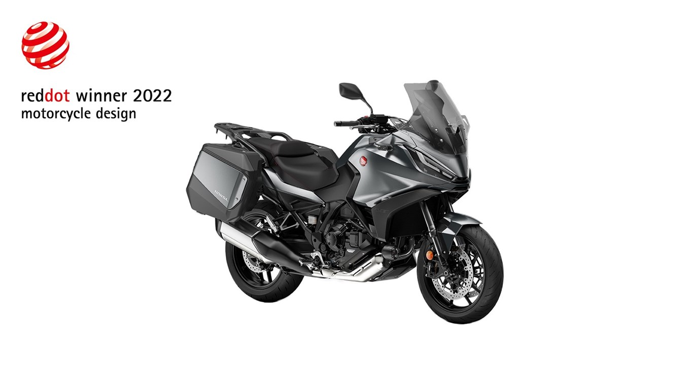
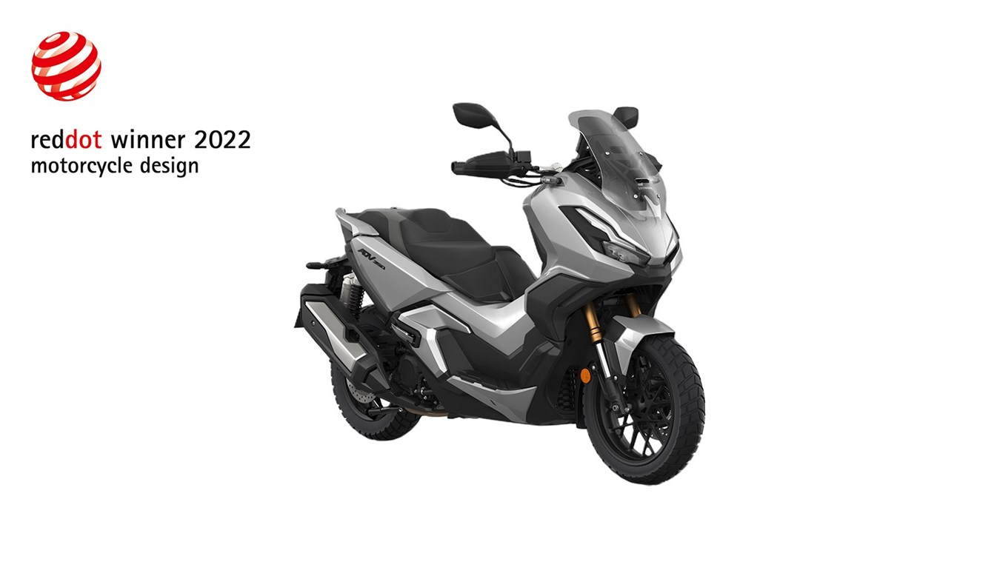
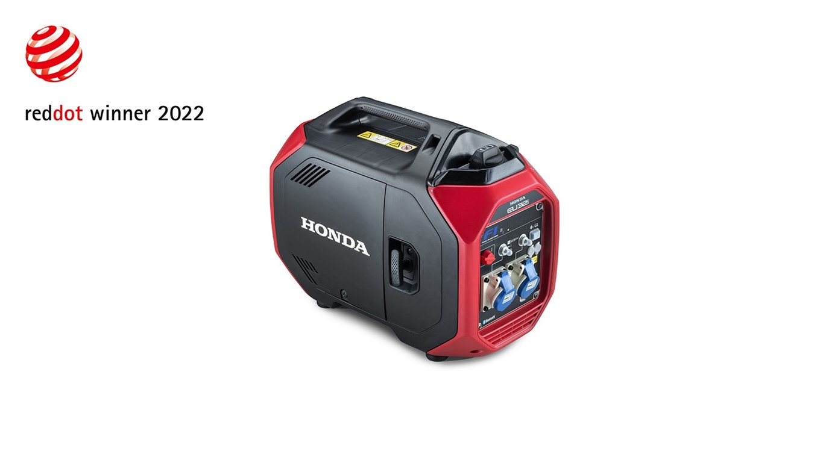

## Honda po raz pierwszy zdobyła nagrody Red Dot we wszystkich grupach produktów.
- Nowa Honda HR-V e:HEV doceniona za jakość stylistyczną i innowacyjność.
- Wyróżnione za walory stylistyczne zostały także motocykl NT1100 i skuter ADV350.
- Czwartym z wyróżnionych produktów Hondy jest nowatorski generator EU32i.

Nowy kompaktowy SUV Hondy HR-V e:HEV, motocykl turystyczny NT1100, skuter klasy adventure ADV350 oraz generator prądotwórczy EU32i otrzymały nagrody Red Dot Award w kategorii „Product Design 2022”. Po raz pierwszy Honda zdobyła tę nagrodę we wszystkich grupach produktowych: **dla motocykli, samochodu oraz maszyn i urządzeń**. Wysoko cenione nagrody przyznawane są tylko produktom, które wyróżniają się pod względem wzornictwa i innowacyjności.

## Nagroda dla HR-V

Nowoczesne wzornictwo HR-V nawiązuje do dyskretnej, eleganckiej stylistyki innych nowych modeli Hondy, uhonorowanej wieloma międzynarodowymi nagrodami przyznanymi w ostatnich latach. W poprzedniej edycji konkursu Red Dot 2021, w kategorii Product Design zwyciężyły modele Jazz e:HEV, Jazz Crosstar e:HEV i duży skuter Forza 750, natomiast Honda e zdobyła w poprzednim roku nagrodę Best of the Best. Wyróżnienie to zostało przyznane równocześnie Hondzie CBR1000RR-R Fireblade SP, która jest pierwszym motocyklem Hondy, który zdobył nagrodę Red Dot.

Etykieta zwycięzcy Red Dot stała się jednym z najbardziej pożądanych znaków jakości w dziedzinie wzornictwa produktów na całym świecie. O przyznaniu corocznych nagród decyduje jury złożone z 50 międzynarodowych ekspertów, którzy testują, oceniają i dyskutują na temat każdego zgłoszonego produktu. Kryteria oceny są co roku poddawane weryfikacji i dostosowywane, aby odzwierciedlały najnowsze wymagania techniczne, społeczne, ekonomiczne i ekologiczne.

>_„Cieszymy się, że po raz pierwszy otrzymaliśmy nagrodę Red Dot Product Design Award we wszystkich grupach produktów Hondy: za  motocykle, samochód oraz w grupie maszyn i urządzeń”_ – powiedział Toshinobu Minami, dyrektor operacyjny Centrum Stylistycznego w Ośrodku Badawczo-Rozwojowym Hondy. _„Wierzymy, że jest to rezultatem konsekwentnie realizowanego pragnienia Hondy, aby «służyć ludziom poprzez technologię, idee i wzornictwo produktów», co jest naszą podstawową zasadą od początku istnienia firmy. Będziemy nadal podejmować wysiłki, aby zaskakiwać i ekscytować naszych klientów.”_

Inżynierowie Hondy na etapie rozwojowym najnowszej generacji HR-V zmienili gruntownie założenia modelu, decydując się na zaprojektowanie kompaktowego SUV-a od podstaw. Badania przeprowadzone przez Hondę wykazały, że współcześni konsumenci wybierają produkty nie tylko kierując się konkurencyjnymi osiągami, czy estetyką, ale także na podstawie tego, jak włączają się one w scenariusze ich życia i czy dany produkt spełnia indywidualne wymagania.

W rezultacie HR-V nowej generacji ma współczesne nadwozie typu SUV-coupe, które stanowi atrakcyjne, a zarazem rzadkie połączenie dynamicznego wzornictwa klasy premium z wyjątkowo efektywnym rozplanowaniem przestrzeni. Zarówno wnętrze, jak i nadwozie są odzwierciedleniem nowej, prostej, klarownej i nowoczesnej stylistyki Hondy, którą prezentują ostatnie modele. Z powodzeniem umacnia ona reputację marki w zakresie jakości, funkcjonalności i walorów praktycznych.

## NT1100 z nagrodą Red Dot

Model NT1100, zaprezentowany w październiku 2021 r., zapoczątkował nową erę motocykli turystycznych. NT1100 to wygodny, zwrotny i – co najważniejsze – niezwykle przyjemny w prowadzeniu motocykl, którego stylistyka nawiązuje do bogatego dziedzictwa Hondy w klasie motocykli turystycznych. Jego przeznaczeniem jest zwrócenie uwagi zarówno doświadczonych motocyklistów, jak i nowego pokolenia, które poszukuje walorów typowych dla motocykla turystycznego, takich jak komfort i funkcjonalność, jednakże bez przesadnie «przygodowego» wzornictwa i charakteru.

Został on opracowany we włoskim centrum badawczo-rozwojowym Hondy w Rzymie przez Maurizio Carbonarę (odpowiedzialnego również za niezwykle popularne modele CRF1100L Africa Twin i X-ADV). Założeniem projektu był «proaktywny komfort». Czyste, eleganckie formy uzupełnione są wrażeniem lekkości, dzięki zwiększonej wysokości i poziomym liniom sylwetki nadwozia, które podkreślają nowy wymiar przyjemności z jazdy motocyklem turystycznym.

## Skuter Hondy zdobywcą Red Dot - ADV350

Drugi nagrodzony jednoślad Hondy, skuter klasy adventure ADV350, czerpie inspirację z wyglądu i charakteru modelu X-ADV o pojemności 750 cm3, który w momencie wprowadzenia na rynek w 2017 r. został nazwany «pierwszym dwukołowym SUV-em» dzięki surowym, kanciastym liniom stylistycznym, różnorodności powierzchni, dużemu prześwitowi, zawieszeniu o dużym skoku i funkcjonalności typowej dla skuterów. ADV350 przenosi to innowacyjne spojrzenie na rynek skuterów o średniej pojemności pod hasłem «New Urban Adventure» (Nowa miejska przygoda). Jego terenowy styl uzupełnia autentyczna zdolność do radzenia sobie na asfalcie dzięki wyjątkowemu w tej klasie oryginalnemu zawieszeniu motocykla.

## Generator prądotwórczy

Dopełnieniem nagradzanej grupy produktów Hondy jest niedawno wprowadzony na rynek generator EU32i, który oferuje ogromną moc w przyjaznym dla użytkownika, elegancko zaprojektowanym opakowaniu. Jest to pierwsze na świecie zastosowanie silnika o dużej mocy z wtryskiem paliwa w przenośnym generatorze, który może pochwalić się imponującą mocą 3200 W oraz utrzymywaną przez cały czas wydajnością, która wcześniej była spotykana tylko w samochodach i morskich silnikach zaburtowych. Urządzenie zostało nawet wyposażone w specjalną aplikację na smartfony, która dzięki łączności Bluetooth umożliwia użytkownikom monitorowanie stanu generatora i zdalne sterowanie.

Ostatnie sukcesy Hondy w Red Dot w kategorii samochodów są kontynuacją długiej serii zwycięstw w tym konkursie, w którym wcześniej doceniono modele: Honda S2000 w 2001 r., Civic w 2006 r. i Accord Tourer w 2008 r.

_Informacja prasowa_