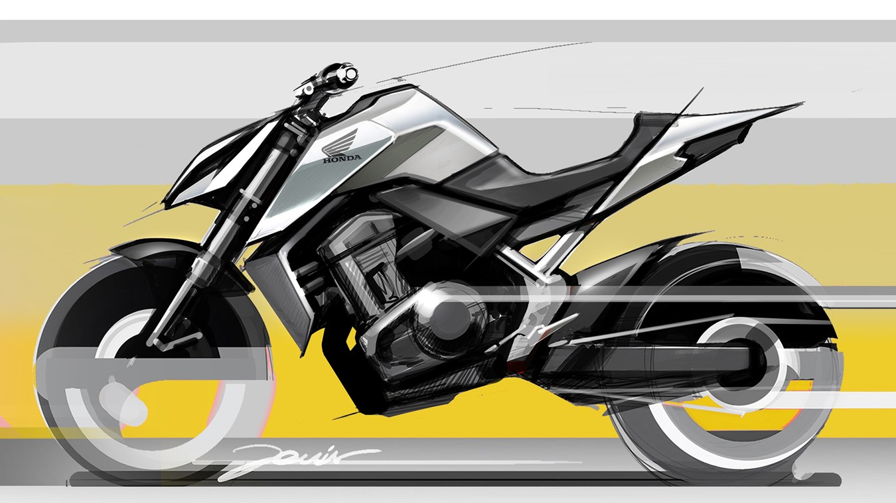
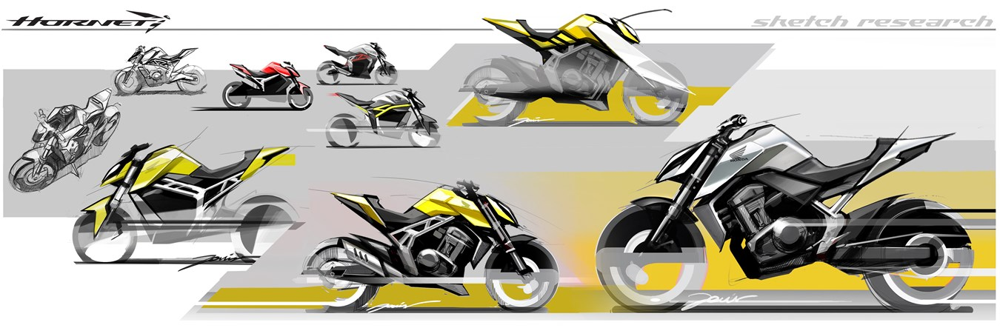
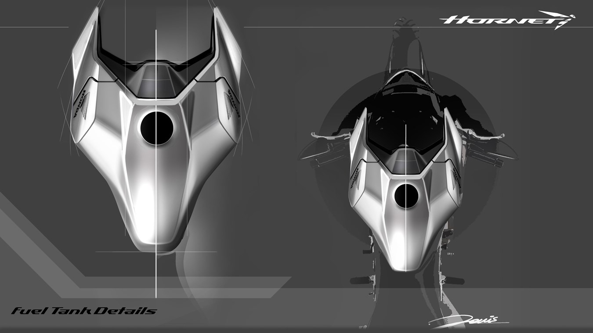

<iframe width="100%" height="415" src="https://www.youtube.com/embed/bTACoMJM6-M" title="YouTube video player" frameborder="0" allow="accelerometer; autoplay; clipboard-write; encrypted-media; gyroscope; picture-in-picture" allowfullscreen></iframe>

Zgodnie z informacjami podanymi podczas targów EICMA 2021, dotyczącymi powrotu Horneta do oferty, Honda opublikowała dziś szkice zdradzające kolejne szczegóły koncepcji stylistycznej modelu. Przedstawiono na nich wyjątkowe połączenie technicznego piękna i ostrych linii, przenikających DNA modelu.

Prace nad szkicami koncepcji stylistycznej Horneta prowadzone były w centrum badawczo-rozwojowym Hondy w Rzymie. Ścisła współpraca centrum z działem badawczo-rozwojowym w Japonii, zaowocowała sukcesem wielu ostatnio wprowadzonych na europejski rynek modeli Hondy, w tym **[CRF1100L Africa Twin](https://mototrips.pl/moto-test/nowa-honda-afryka-twin-adventure-sport-crf1100l/)**, **CB650R** i **X- ADV**.

Projektantem nowej koncepcji stylistycznej Horneta jest 28-letni Giovanni Dovis, który jest również autorem charakterystycznych linii nowego ADV350.

Giovanni Dovis, projektant, Honda R&D Europe, Włochy:

>„Filozofią projektową Hondy jest tworzenie czegoś czystego i funkcjonalnego w nieskomplikowany sposób – modeli, które są proste, a zarazem piękne i emocjonalnie pociągające. Szkice koncepcji projektowej Horneta obiecują zwinność, dynamikę i lekkość maszyny dzięki smukłym proporcjom, spiczastej sekcji ogonowej i bardzo ostrym, odważnym liniom. Otrzymał on nową, kompaktową sylwetkę z charakterystycznymi cechami odzwierciedlającymi prawdziwego sportowego ducha Horneta”.

*Informacja prasowa*