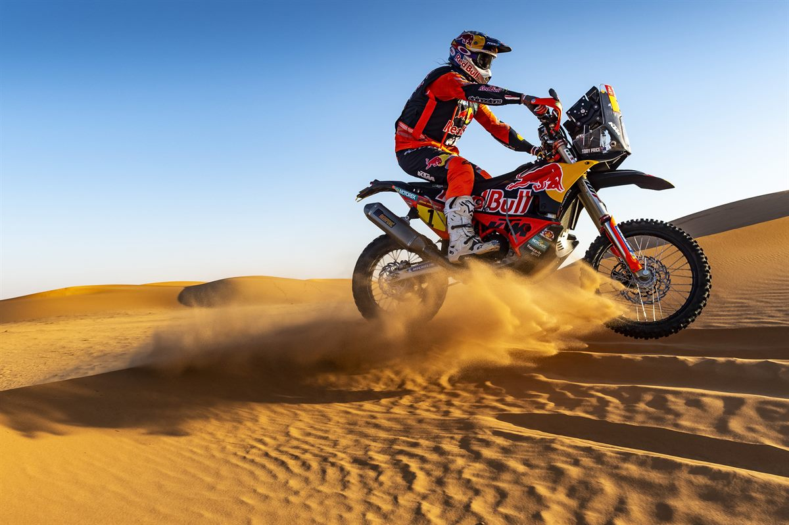

Dewiza **KTM „READY TO RACE"** została wdrożona w KTM 450 RALLY REPLICA z 2021 roku. W ostatnich latach ten model poprzez limitowane wersje produkcyjne uzyskał wysoki status dzięki pracy i osiągnięciom i wniosków Toby Price'a, Matthiasa Walknera i Sama Sunderlanda z Red Bull KTM Factory Racing. To motocykl zaprojektowany tak, aby wyróżniać się w wieloetapowych rajdach terenowych, spełniać nawet najtrudniejsze wymagania rajdowców i wygrywać.

Ognisty silnik z wtryskiem paliwa SOHC ma pojemność 450 cm3. Ponadto zastosowano zamknięte zawieszenie wkładu WP XACT PRO z zaawansowaną technologią zaworu stożkowego oraz aerodynamikę i ergonomię stworzoną z myślą o intuicyjnej obsłudze w terenie.

## Nowości zaciągnięte z Rajdu Dakar
Na 2021 rok KTM udoskonalił pakiet silników, wprowadzając nową skrzynię biegów i poprawiony mechanizm zmiany biegów. Zastosowanie materiałów PANKL Racing Systems w dziale KTM Motorsport oznaczało, że technicy mogli dalej podnosić doskonałą niezawodność motocykla, ale także dodać więcej korzyści dla kierowcy, dzięki zwiększeniu elastyczności skrzyni biegów. W rezultacie KTM 450 RALLY REPLICA ma teraz takie same przełożenia, jak te zastosowane w maszynach mistrzów Rajdu Dakar.

Stefan Huber, lider zespołu Red Bull KTM Factory Racing Rally mówi: „Praca trwa. Jesteśmy dumni z 2021 KTM 450 RALLY REPLICA. Dzięki temu modelowi postawiliśmy poprzeczkę bardzo wysoko, dając klientom produkt tak bliski temu, co przygotowujemy i zabieramy na rajdy na całym świecie. Oczywiście zawsze dokonujemy modyfikacji, co oznacza, że ​motocykl z 2021 roku jest znacząco ulepszony. Konstrukcja i konfiguracja skrzyni biegów będą miały znaczenie dla kierowców, którzy będą zmuszeni pchać KTM 450 RALLY REPLICA. Bardzo ważne jest, abyśmy mogli przekazać to, czego się nauczyliśmy, bezpośrednio w ręce użytkowników KTM. Jesteśmy tutaj, aby wygrywać wyścigi, ale tworzenie lepszego produktu jest bardzo ważne i satysfakcjonujące. Osobiście nie mogę się doczekać, kiedy zobaczę tę niesamowitą maszynę w wyścigach podczas nadchodzącego Rajdu Dakar 2021! "

**2021 KTM 450 RALLY REPLICA** to bardzo poszukiwany model w limitowanej edycji, ograniczony do 85 sztuk na całym świecie. Cenę ustalono na poziomie 25.900 EUR (plus VAT i przesyłka), a motocykle będą dostępne od września 2020 r. Pakiet usług i wsparcia jest dostępny dla ograniczonej liczby kierowców na Rajdzie Dakar, a za dodatkową opłatą dla wszystkich modeli KTM Rally. Więcej informacji można uzyskać u autoryzowanego sprzedawcy KTM lub na stronie www.ktm.com.

Stefan Huber, lider zespołu Red Bull KTM Factory Racing Rally mówi: „Praca trwa. Jesteśmy dumni z 2021 KTM 450 RALLY REPLICA. Dzięki temu modelowi postawiliśmy poprzeczkę bardzo wysoko, dając klientom produkt tak bliski temu, co przygotowujemy i zabieramy na rajdy na całym świecie. Oczywiście zawsze dokonujemy modyfikacji, co oznacza, że ​motocykl z 2021 roku jest znacząco ulepszony. Konstrukcja i konfiguracja skrzyni biegów będą miały znaczenie dla kierowców, którzy będą zmuszeni pchać KTM 450 RALLY REPLICA. Bardzo ważne jest, abyśmy mogli przekazać to, czego się nauczyliśmy, bezpośrednio w ręce użytkowników KTM. Jesteśmy tutaj, aby wygrywać wyścigi, ale tworzenie lepszego produktu jest bardzo ważne i satysfakcjonujące. Osobiście nie mogę się doczekać, kiedy zobaczę tę niesamowitą maszynę w wyścigach podczas nadchodzącego Rajdu Dakar 2021!"

**2021 KTM 450 RALLY REPLICA** to bardzo poszukiwany model w limitowanej edycji, ograniczony do 85 sztuk na całym świecie. Cenę ustalono na poziomie 25.900 EUR (plus VAT i przesyłka), a motocykle będą dostępne od września 2020 r. Pakiet usług i wsparcia jest dostępny dla ograniczonej liczby kierowców na Rajdzie Dakar, a za dodatkową opłatą dla wszystkich modeli KTM Rally. Więcej informacji można uzyskać u autoryzowanego sprzedawcy KTM lub na stronie <a href="http://www.ktm.com" target="_blank" rel="noopener noreferrer">www.ktm.com</a>.