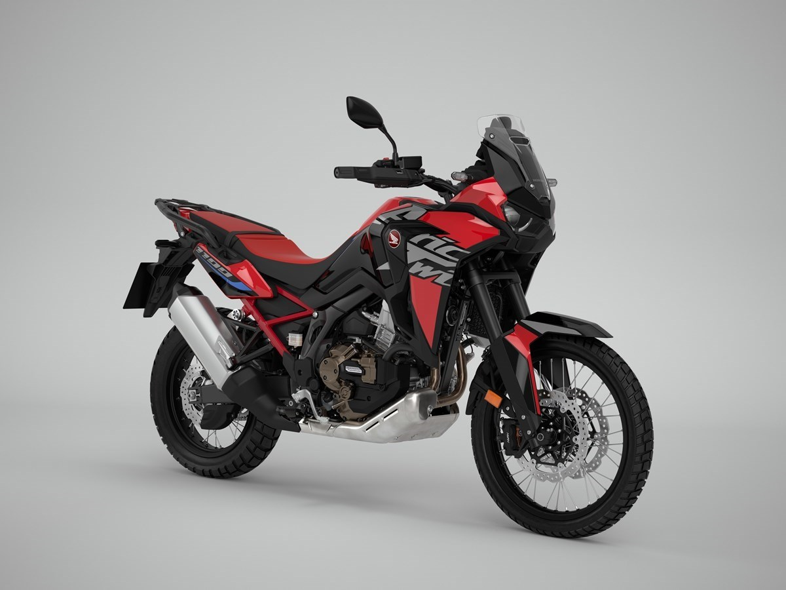
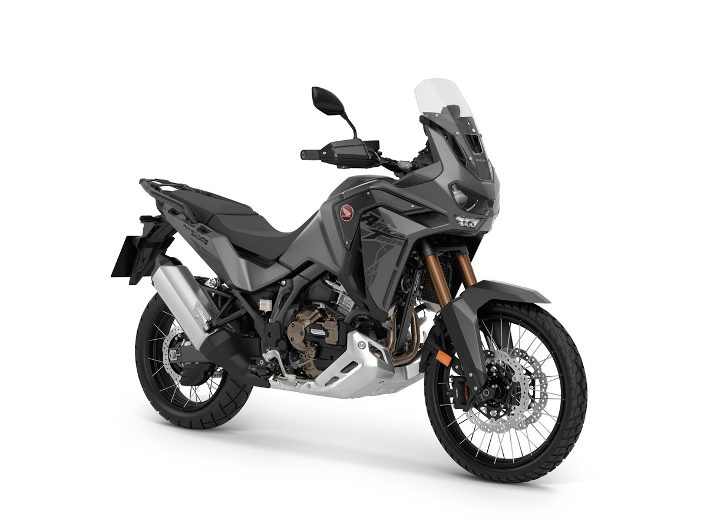
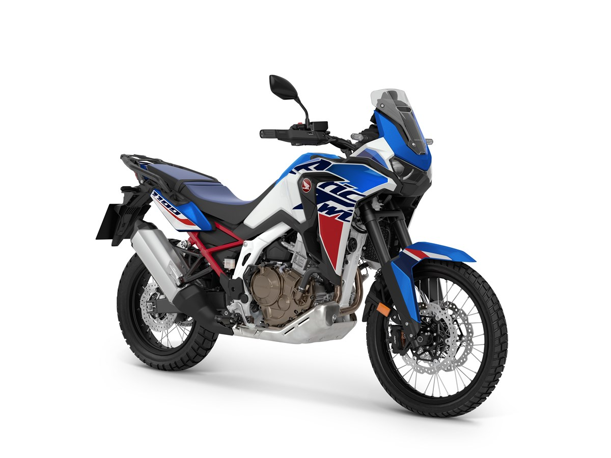

- Africa Twin i Africa Twin Adventure Sports na rok 2023 otrzymają nowy wygląd
- Nowe opcje kolorystyczne dla CRF1100L Africa Twin: zaktualizowany Mat Ballistic Black Metallic i nowy Glint Wave Blue Metallic Tricolor
- Przeznaczony do dalekich podróży CRF1100L Africa Twin Adventure Sports w nowym kolorze Mat Iridium Grey Metallic
- W 2021 r. 51% nabywców modelu Africa Twin wybrało dwusprzęgłową przekładnię DCT

Atletyczny, lekki, sportowy model Africa Twin CRF1100L na rok 2023 będzie dodatkowo oferowany w dwóch zaktualizowanych kolorystykach. Do kultowego Grand Prix Red, dostępnego dla modelu Africa Twin z 2022 r., dołączą malowania: Mat Ballistic Black Metallic, teraz w komplecie z całkowicie czarną ramą oraz nowe – Glint Wave Blue Metallic Tricolor – z nową niebieską osłoną reflektora oraz niebieskim przednim błotnikiem i tylną częścią z czerwonymi i białymi detalami.

Dedykowany podróżom CRF1100L Africa Twin Adventure Sports, który w 2021 r. stanowił 56% sprzedaży modelu Africa Twin, w modelu na rok 2023 będzie dostępny w dwóch charakterystycznych kolorach. W ofercie pozostaje ponadczasowy trójkolorowy Pearl Glare White ze złotymi kołami, natomiast nową opcją będzie współcześnie prezentujący się Mat Iridium Grey Metallic z czarnymi detalami i z czarnymi kołami.

Obie odmiany modelu Africa Twin będą oferowane z manualną lub dwusprzęgłową skrzynią biegów DCT. Od momentu, gdy przekładnia DCT po raz pierwszy pojawiła się jako opcja w modelu VFR1200F w 2009 roku, Honda sprzedała w Europie ponad 200 000 wyposażonych w nią motocykli. O akceptacji tego rozwiązania przez klientów świadczy fakt, że w 2021 roku 51% sprzedaży modelu Africa Twin, w tym odmiany Adventure Sports, stanowiły wersje wyposażone w przekładnię DCT. Dla modelu Africa Twin udział ten wyniósł 41%, a dla odmiany Adventure Sports – aż 61%.

*Informacja prasowa*