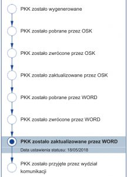

PKK to unikalny numer który uzyskujecie w wydziale komunikacji. Każdy kandydat na kierowcę od 2014 roku musi go uzyskać zanim będzie mógł zapisać się na kurs lub zgłosić do WORD na egzamin. Wydrukowany dokument otrzymujecie w ciagu ok 10 minut i jest on niezbędny do otrzymania uprawnień do kierowania pojazdami.
<h2>Jakie kroki musisz podjąć</h2>
<ul>
 	<li><strong>Badanie lekarskie</strong> – to lekarz zdecyduje czy możesz prowadzić pojazdy czy nie. Jest to obowiązkowy pierwszy krok. Warto zapytać szkołę jazdy na pewno współpracują z jakimś lekarzem i kogoś wam polecą. Warto również poszukać w internecie możecie znaleźć tańszą opcję.</li>
 	<li><strong>Składamy wniosek</strong> – oprócz samego wniosku pamiętajcie o pozostałych dokumentach (listę znajdziecie na dole strony).</li>
 	<li><strong>Otrzymujesz PKK</strong></li>
</ul>
<h3>Wariant nr 1</h3>
<ul>
 	<li>Szkoła jazdy – zgłaszasz się do szkoły jazdy na kurs teoria + praktyka (pamiętaj o PKK – zostanie on wczytany do systemu).</li>
 	<li>Egzamin wewnętrzny.</li>
 	<li>Zapisujesz się do WORD na teorię (Pamiętaj o PKK)</li>
 	<li>Zdajesz egzamin teoretyczny</li>
 	<li>Zapisujesz się na egzamin praktyczny.</li>
 	<li>Zdajesz.</li>
</ul>
Reszta dzieje się automatycznie, wniosek jest przesyłany do wydziału komunikacji, opłacasz nowy dokument i odbierasz.
<h3>Wariant nr 2</h3>
<ul>
 	<li>Samodzielnie przygotowujesz się do teorii – tak jak ja. Pamiętaj, żeby NIE PODAWAĆ PKK w szkole jazdy – zostanie on zablokowany i nie będziesz mógł się zapisać w WORD na egzamin teoretyczny.</li>
 	<li>Zapisujesz się na egzamin teoretyczny w WORD.</li>
 	<li>Przechodzisz kurs praktyczny w szkole nauki jazdy (pamiętaj o PKK). Zostaje on zablokowany do czasu ukończenia kursu. Następnie musi zostać odblokowany, żebyś mógł się zapisać na egzamin praktyczny w WORD.</li>
</ul>
Reszta odbywa się analogicznie do wariantu nr 1.
<h2>Info-car.pl</h2>

Polecam skorzystać z platformy [info-car.pl](http://info-car.pl/) Dzięki niej możecie śledzić online co dzieje się z waszym elektronicznym dokumentem PKK – zrzut ekranu obok. Ponad to sprawdzicie jaki jest status waszego prawa jazdy, czy już wniosek jest przetwarzany, dokument się wydrukował (wystarczy podać numer PESEL, imię i nazwisko) itp. Co jeszcze bardzo przydatne to możliwość zapisania się na egzamin bez wychodzenia z domu! Tylko <strong>uwaga</strong>najpierw sprawdźcie co z waszym PKK, czy został już uwolniony przez szkołę jazdy, jeśli zapiszecie się i opłacicie egzamin, a numer PKK nie został uwolniony przez szkołę nie dojdzie do zapisu a wasze pieniądze zostaną zablokowane w WORD (tak było w moim przypadku…) :/

U mnie od momentu opłacenia prawka do odbioru minął równo tydzień! Ekspersowo.

<h2>Co trzeba przygotować do urzędu</h2>
<ul>
 	<li>[Wniosek o wydanie prawa jazdy](https://obywatel.gov.pl/documents/10181/0/Wniosek+o+wydanie+prawa+jazdy2016/12d9720a-9600-43c1-a49c-f54728684dcc) (PDF 2 MB) – pobierz i wypełnij w domu albo weź w urzędzie.</li>
 	<li>Orzeczenie lekarskie.</li>
 	<li>Aktualne zdjęcie. (specyfikacja poniżej) sprawdź, jak powinno wyglądać zdjęcie! ja przez niewiedzę musiałem jeździć dwa razy.</li>
 	<li>Dowód osobisty albo paszport. Jeśli jesteś cudzoziemcem, weź paszport albo kartę pobytu.</li>
 	<li>Ksero dotychczasowego prawa jazdy – jeśli masz już prawo jazdy i chcesz uzyskać uprawnienie na kolejną kategorię.</li>
 	<li>Pisemną zgodę rodziców albo opiekuna prawnego – jeśli masz 17 lat i wkrótce ukończysz 18 lat. W dokumencie rodzic albo opiekun prawny musi wyrazić zgodę na rozpoczęcie kursu i wydanie prawo jazdy. Pamiętaj, że Twój rodzic albo opiekun prawny musi podpisać taki dokument przy urzędniku. Dlatego najlepiej idź do urzędu wraz z rodzicem albo opiekunem prawnym.</li>
 	<li>Orzeczenie psychologiczne o braku przeciwwskazań psychologicznych do kierowania pojazdem – jeśli chcesz dostać [prawo jazdy kategorii: C1, C1+E, C, C+E, D1, D1+E, D, D+E](https://www.gov.pl/web/gov/kategorie-prawa-jazdy) albo gdy starosta skierował Cię na badania psychologiczne.</li>
</ul>
<h2>Jakie powinno być zdjęcie do prawa jazdy</h2>
<ul>
 	<li>kolorowe,</li>
 	<li>aktualne (fotografia powinna być wykonana nie wcześniej niż 6 miesięcy przed dniem złożenia wniosku),</li>
 	<li>wyraźne,</li>
 	<li>ostre,</li>
 	<li>wykonane na jednolitym jasnym tle,</li>
 	<li>w wymiarach: 35 x 45 mm,</li>
 	<li>powinno odwzorowywać naturalny kolor skóry,</li>
 	<li>powinno obejmować wizerunek od wierzchołka głowy do górnej części barków, tak aby twarz zajmowała 70-80% fotografii, pokazywać wyraźnie oczy, zwłaszcza źrenice, i przedstawiającą osobę w pozycji frontalnej, bez nakrycia głowy i okularów z ciemnymi szkłami, patrzącą na wprost z otwartymi oczami nieprzesłoniętymi włosami, z naturalnym wyrazem twarzy i zamkniętymi ustami.</li>
</ul>

## Pytania i odpowiedzi
- **Elwira**
Kupno motocykla z zagranicy - podatek płacić nie płacić?

> Ogólna zasada jest taka, że jeśli motocykl/motorower sprowadzasz z kraju Unii Europejskiej to jesteś zwolniony z akcyzy oraz VAT-u. Wyjątkiem są tu nowe maszyny, za które należy opłacić podatek VAT w wysokości 23% niezależnie czy były sprowadzane z Unii czy nie. Jako nową maszynę traktuje się pojazd którego pierwsza rejestracja miała miejsce 6 miesięcy wstecz lub jej przebieg nie przekracza 6000 km.

- **Martyna** 
Witam ukonczylam kurs na prawo jazdy w 2015 roku i zdałam egzamin teoretyczny. Podchodziłam do egzaminu praktycznego kilka razy niestety z marnym skutkiem. Teraz chce wrócić i zdać. Zaktualizowałam w wydziale komunikacji w starostwie mój profil pkk ponieważ zmieniłam nazwisko. Jak długo trwa taka aktualizacja? Chciałam od razu zapisać się na egzamin praktyczny online jednak wyświetla się komunikat o błędzie bądź nieaktualnych danych itp. Czy to oznacza że mam odczekać kilka dni aż pkk będzie odblokowane i wtedy się zapisać?
Chciałabym dodać do mojego komentarza jeszcze kilka zdań. Wykupiłam dodatkowe jazdy w innej szkole jazdy niż ta do której kiedyś uczęszczałam. Podałam nr pkk. Gdy po pobrali rozumiem że został zablokowany? I dlatego nie mogę zapisać się na egzamin praktyczny? Jeśli tak to jak długo będzie zablokowany? Kiedy mogę się zapisać na egzamin praktyczny?

> Pobrany numer PKK będzie w OSK tak długo aż go nie odblokują, musisz się do nich zgłosić, żeby “odkliknęli” w systemie.
Generalnie za moich czasów takie dodatkowe jazdy załatwiało się bez PKK…

- **Piotrek**
Hej,
Właśnie kończę kurs w OSK. Zostało mi dosłownie 5 godzin, ale Pani już zaktualizowała mój PKK i może zostać pobrany przez WORD. Czuję, że będę musiał dokupić kilka jazd przed częścią praktyczną. Problem polega na tym, że chciałbym je kupić u innego instruktora, który pracuje w innym ośrodku. Czy na chwilę obecną muszę oznajmiać mojej szkole, że zmieniam ośrodek na godziny dodatkowe? Planowałem wyjeździć brakujące 5h i podziękować im za współpracę bez składania jakichś rezygnacji etc. Po zakończeniu kursu jestem “wolny” jeśli chodzi o dalszą naukę i wystarczy podać PKK w innym ośrodku?
Pozdrawiam

> To częsta praktyka, żeby móc się zapisać na egzamin wcześniej, a np zostawić sobie kilka godzin do wyjeżdżenia przed egzaminem.
Proponuję zapisać się na egzamin i już nie martwić się PKK, jak będziesz miał termin egzaminu dobierz tak lekcje, żeby przećwiczyć wszystko zaraz przed nim.
Powodzenia!
Przemek

- **Adam**
Hej. Zdałem egzamin z teorii ok. 6 lata do egzaminu z jazdy w ogole nie podchodziłem. Planuje rozpocząć cały kurs od 0 w nowej szkole. Czy moje pkk zostało zwrócone do starego OSK?

> Cześć,
nie Twoje PKK powinno być cały czas w WORD.
Powodzenia i pozdrawiam,
Przemek