<iframe width="100%" height="315" src="https://www.youtube.com/embed/4sNMPt0hN0g" title="YouTube video player" frameborder="0" allow="accelerometer; autoplay; clipboard-write; encrypted-media; gyroscope; picture-in-picture" allowfullscreen></iframe>

<h2>Numer VIN motocykla co to jest i gdzie go znajdziesz?</h2>

<strong>VIN to taki PESEL dla pojazdu</strong>. Każdy samochód motocykl, kład, ciężarówka czy nawet naczepa go posiada 17 znaków które rozkodowane mogą wiele powiedzieć o <strong>historię pojazdu</strong> którym jesteś zainteresowany. Zakodowane w nim są podstawowe dane takie jak marka model rok produkcji ale i wiele dodatkowych których rozszyfrowanie wymaga trochę zachodu.

<h3>Gdzie znajdę VIN motocykla</h3>

Znalezienie VIN (vehicle identification number) nie powinno nastręczyć wam zbyt wielu kłopotów. Znajduje się on na <strong>tabliczce znamionowej</strong> i ukryty jest w kilku miejscach na samochodzie, na motocyklu na przykładzie mojego BMW F850GS adv jest z przodu pomiędzy amorkiem jak na poniższym zdjęciu.

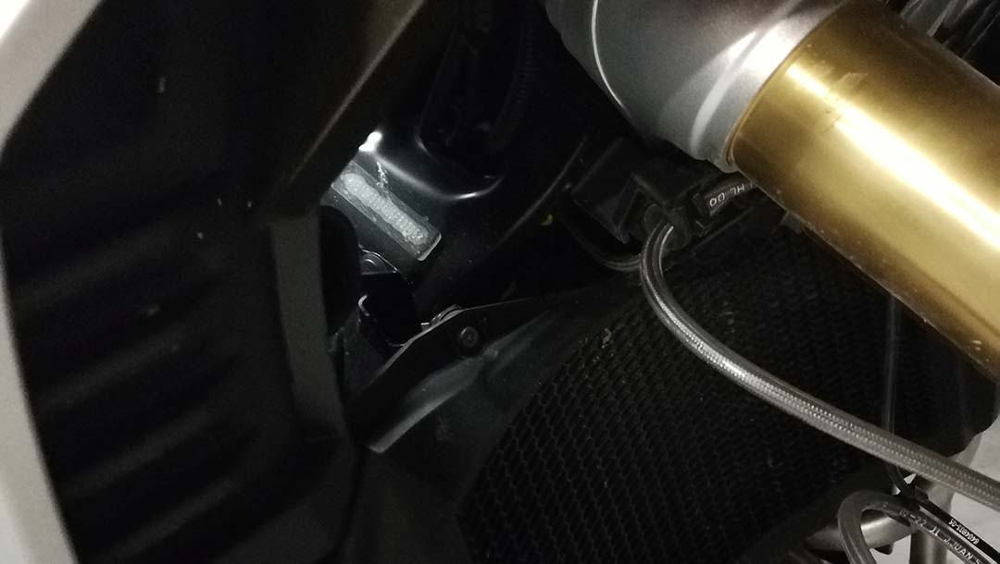

Tak naprawdę nawet nie musisz podchodzić do motocykla wystarczy, zajrzeć do dowodu rejestracyjnego - <strong>VIN jest zapisany pod pozycją E</strong>.

Przejdźmy do rozkodowania VIN (inaczej numer nadwozia), tu pojawiają się portale internetowe zacznijmy od tego co udostępnia nasz rząd. <strong>Centralna ewidencja pojazdów</strong>, podobne instytucje świadczą tego typu usługi w całej Unii Europejskiej.

<h2>Historiapojazdu.gov.pl - CEPik</h2>

Tu sprawdzicie vin motocykla bezpłatnie, jest jednak jedno ale, a właściwie trzy...

Żeby uzyskać informacje musicie mieć <strong>numer vin motocykla</strong> to jasne i sprzyjają nam w tym przypadku portale aukcyjne do dłuższego już czasu Otomoto wymaga podawania VIN podczas publikacji ogłoszenia i dobrze to żadna dana osobowa (przynajmniej w Polsce - w Niemczech nie ma takiej możliwości) nie bójcie się go podawać nikt nie jest w stanie was namierzyć po VIN - nie ma tam zapisanego waszego adresu zamieszkania, zameldowania, nic z tych rzeczy. Tak samo po <strong>tablicach rejestracyjnych</strong> możecie co najwyżej sprawdzić czy pojazd jest ubezpieczony, również za darmo i służy do tego ta strona: <a target="_blank" rel="noopener noreferrer" href="https://www.ufg.pl/infoportal/faces/oracle/webcenter/portalapp/pagehierarchy/Page190.jspx?_afrLoop=951769658032482&amp;fppl=true&amp;_afrWindowMode=0&amp;_adf.ctrl-state=o3o8eg9mq_46">Ubezpieczeniowy Fundusz Gwarancyjny</a>. Trzecią rzeczą która będzie wam potrzebna jest <strong>data pierwszej rejestracji. </strong>Dopiero mając te trzy informacje za darmo na stronie <a target="_blank" rel="noopener noreferrer" href="https://historiapojazdu.gov.pl/">HistoriaPojazdu.gov.pl</a> dowiecie się jaka była przeszłość jednośladu, którego sobie upatrzyliście.

<h2>carVertical marketing czy coś więcej?</h2>

Stąd właśnie pomysł na ten artykuł i weryfikację. Wpadły mi w oko reklamy w których mi nie znany motocyklista <a target="_blank" rel="noopener noreferrer" href="http://tiktok.com/@sheraszyske">
<strong>Sheraszyske</strong>
</a> - link do TikTok pokazuje jak przeskakuje nad wartym jakieś milion złotych Lamborgini. OK trzeba im przyznać mają rozmach ale odłóżmy na bok marketing. Mówię zatem sprawdzam i kupuję dwa raporty od Litwinów. Na pierwszy ogień idzie Yamaha Tracer 900.

<h3>Co znajdziecie (lub nie) w raporcie carVertical?</h3>

Po wpisaniu VIN na stronie firmy mamy pierwszy chwyt marketingowy, Litwini podają, że sprawdzają pewne informacje, nie jest to jednak równoznaczne z tym, że raport który zamówicie będzie je zawierał, należy więc uważać. To co <strong>może</strong> ale podkreślę jeszcze raz <strong>nie musi</strong> się w nim znaleźć:

<ul>
	<li>uszkodzenia</li>
	<li>cofnięty licznik</li>
	<li>archiwalne zdjęcia</li>
	<li>ilość właścicieli</li>
	<li>zapisy o kradzieżach</li>
	<li>typowe usterki</li>
	<li>inne przydatne informacje</li>
</ul>
<h3>Ile kosztuje raport CV?</h3>

Mamy tu jedną cenę, która może zostać obniżona przy większym zakupie, prawdopodobnie będziesz chciał sprawdzić więcej niż jeden motocykl zanim zdecydujesz się na zakup, chociaż czy ja wiem, jeśli trafi Ci się igiełka to może i wystarczy jeden. Zresztą oceń sam opłacalność.

Za jeden raport carVertical zapłacisz <strong>72,99 zł</strong> (cena na dzień 21.07.2022)

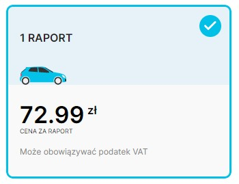

Jeśli zdecydujesz się na dwa raporty jednostkowa cena spada do <strong>44,49 zł</strong> (suma 88,98 zł) widać, że zaczyna się opłacać wziąć dwa tylko 16 zł więcej.

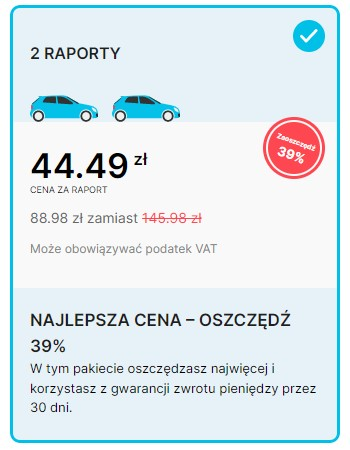

Przy zakupie trzech raportów koszt jednostkowy jeszcze odrobinę spada do <strong>41,99 zł</strong> (suma za 3 = 125,97 zł)

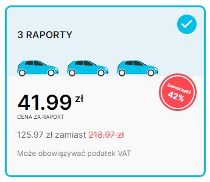

Wybieram 2 raporty, bo mam jeszcze do sprawdzenia dla porównania jednego KTMa i przechodzę dalej. 

<h3>Metody płatności</h3>

Tu pojawia się ciekawostka którą warto się zainteresować (przynajmniej urząd skarbowy mógłby). Otóż domyślnie mam ustawione Stany Zjednoczone i zerowy VAT przy płatności. Zobaczcie sami:

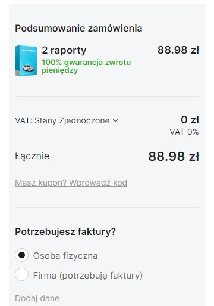

Ciekawe, bo kupuję raport z biura redakcji w Warszawie. Mógłbym tak dokończyć zakup nie płacąc VAT, ja go nie płacę czy carVertical? Kto w takim wypadku jest na bakier z prawem?

Zmieniając kraj na Polskę do ceny doliczany jest wspomniany podatek i rośnie ona do <strong>109,45 zł.</strong>

Do wyboru mamy chyba wszystkie dostępne na rynku metody płatności, blik, szybkie przelewy internetowe, karta, PayPal a nawet możliwość zapłacenia kryptowalutą. Tu musicie wiedzieć, że carVertical jest posiadaczem swojej własnej kryptowaluty i korzystając z niej dostajecie dodatkowe 30% rabatu.

<h3>Raport dotyczący Yamahy Tracer 900</h3>

Na początku widzimy numer vin sprawdzanego motocykla i raport w skrócie, kafelki dotyczące kradzieży, przebiegu i wypadków, czyli to co jest dostępne w sprawdzanym pojeździe.

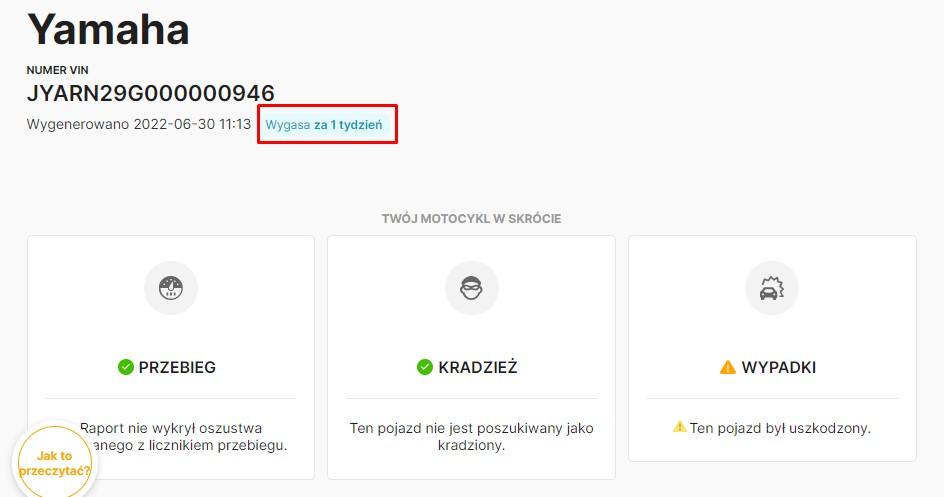

Report ma swój termin przydatności który wynosi 30 dni, po tym czasie zniknie on z waszego konta polecam więc zrobić sobie prt screeny, zapisać jako pdf czy wydrukować.

Szkoda, że oprócz VIN motocykla nie mamy informacji o tym co to za model, kiedy sprawdzicie kilka modeli możecie mieć problem z tym który VIN pasował do którego motocykla.

Historia tego motocykla sięga Francji, tam został zarejestrowany w 2015 roku, co podaje raport.

Oprócz tego mamy jeszcze dwa rekordy dotyczące uszkodzeń, również z tego kraju w lipcu 2018 i październiku 2019.

<h4>Użytkowanie pojazdu</h4>

Kolejna sekcja dotyczy użytkowania pojazdu, wszystko wygląda w porządku, raport nie zwraca żadnych niepokojących wpisów. Pytanie tylko, czy tak  jest w rzeczywistosci, czy carVertical nie ma takich danych? Dlaczego się nad tym zastnawiam? Bo motocykl jest w Polsce a pozycje "Był importowany" i "Był eksportowany" pozostają bez wpisów...

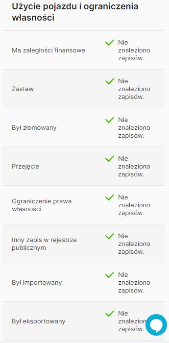

<h4>Skradziony/ nie skradziony?</h4>

Kolejną sekcją raportu dotyczącą tego modelu jest baza pojazdów skradzionych, carVertical sprawdza bazy z 8 krajów - przynajmniej tyle flag naliczyłem i dla sprawdzanej Yamahy rejestry są czyste, nie została skradziona. Jak widzicie taki raport ma swoje zalety, samemu ciężko byłoby znaleźć wszystkie te informacje w internecie, a przynajmniej byłoby to mocno czasochłonne.

<h4>Przebieg</h4>

Tu carVertical zalicza wtopę, którą chce wykorzystać marketingowo. Jest ładny wykres przebiegu ale nijak ma się on do rzeczywistego odczytu licznika. Firma sama drobnym druczkiem informuje nas, że jest to przebieg szacowany. Brak danych dotyczących rzeczywistego przebiegu. Przebieg może wynosić 33 224 km. Ok mogę uznać tą informację za przydatną ale jedynie w odniesieniu do rynku i tego modelu, żeby porównać sobie, czy motocykl który chcę kupić ma wyższy lub niższy przebieg od średniej rynkowej. Nie wiemy natomiast czy był kręcony czy nie.

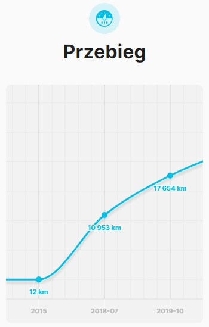

Poniżej wykresu znajdziecie całą listę checkboxów informujących was, że nie znaleziono problemów, ale jak miały się pojawić skoro <strong>nie mają danych dotyczących przebiegu</strong> tego motocykla? Zresztą firma sama za chwilę podaje uwagę w której stwierdzają:

<em>„carVertical” nie może zagwarantować ani poprawności, ani kompletności zapisów przebiegu. W niektórych przypadkach dane zapisu przebiegu mogą być szacunkowe.</em>

<h4>Uszkodzenia - wreszcie jakieś dane</h4>

Tu mamy podane dwa rekordy z ładną wizualizacją motocykla która pokazuje nam gdzie doszło do uszkodzenia i ile ono kosztowało punkt dla Litwinów.

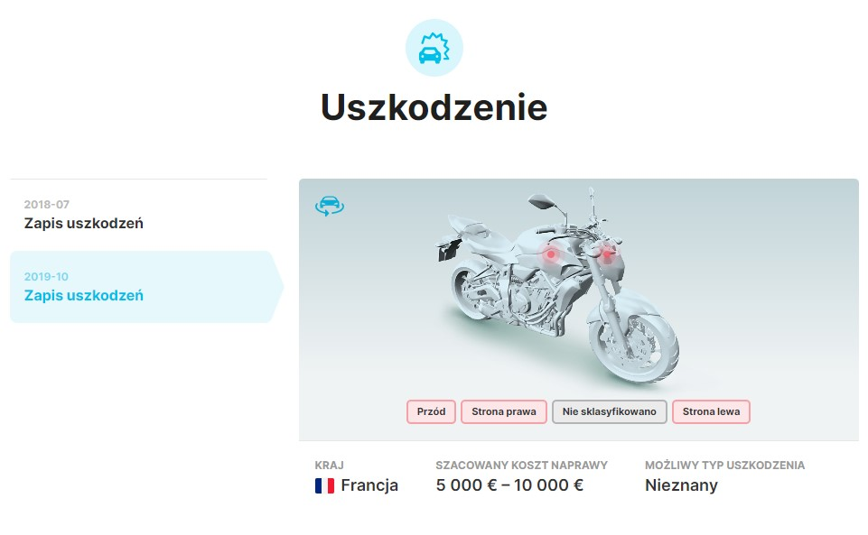

Rzeczywiście warto kupić raport dla takiej informacji. Szkody w wysokości raz 1500 - 3000 euro a następnie 5 - 10 tysięcy euro zdecydowanie dyskwalifikują kupno motocykla.

<h4>Do sprawdzenia</h4>

Na koniec raportu znajdziecie listę 12 kroków które warto podjąć przed kupnem motocykla, co sprawdzić i jak to zrobić, przydatne ale powierzchowne potraktowanie tematu. Warto jest jednak dać za to kolejnego plusa Litwinom. Przejdźmy do drugiego motocykla.

<h3>Raport dotyczący KTM 1290 SUPER ADVENTURE</h3>

Z racji tego, że raport został już dokładnie omówiony teraz podam tylko różnice w stosunku do raportu Yamahy.

KTM to kolejny sprowadzony na Polski rynek motocykl, tym razem jak podaje raport z Belgii. Również mamy 3 rekordy dotyczące tego kraju.

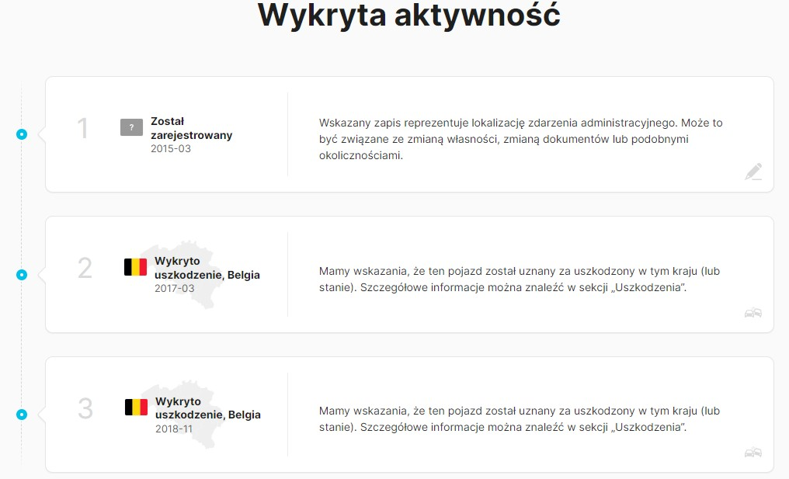

Sekcja Użycia pojazdu nie zawiera informacji - wszystko świeci się na zielono.

Motocykl nie został skradziony, przeszukano tym razem bazy z 7 krajów.

<h4>Przebieg</h4>
**I tym razem brakuje odczytów licznika, a przebieg jest jedynie szacunkowy**. Znacznie jednak wzrosły te szacunki, obydwa motocykle są z 2015 roku, teraz jednak **szacunkowy przebieg wg carVertical** powinien wynosić aż **166 164 km** - czyżby użytkownicy KTMów jeździli więcej niż Yamahą? Większa pojemność na to wpływa, czy Super Adventure w nazwie zobowiązuje, ciekawe.

Wspomniana wcześniej lista pod wykresem również jest cała na zielono, to pewnie ma związek jak poprzednio z brakiem danych.

<h4>Uszkodzenia w raporcie CV</h4>

Odnotowano pomniejsze szkody na terenie Belgii w  2017 i 2018 roku, w wysokości ok 500 - 1500 euro co nie powinno dyskwalifikować tej maszyny przed ewentualnym kupnem.

<h4>Wyposażenie</h4>

To nowa sekcja która nie pokazała się w raporcie dotyczącym Yamahy, zwraca bardzo podstawowe informacje, mianowicie markę, rodzaj nadwozia (szok motocykl) oraz pojemność silnika.

<h2>Podsumowując raporty carVertical</h2>

Mam mieszane uczucia, z jednej strony informacje o szkodach są spoko i dla nich warto je kupić ale tego nie wiecie przy wpisywaniu VIN i płatności za nie. Równie dobrze sprawdzając nowy motocykl bez historii zapłacicie za raport tyle samo a będzie on dosłownie pusty. Jeszcze jedna ciekawostka na koniec strona przeładowując się zwraca w spisie treści informacje co może znajdować się w raporcie. Zobaczcie zatem czego zabrakło.

Od góry niby przebieg się pojawia ale tylko szacunkowy, dyskusyjne. Dla żadnego sprawdzanego motocykla nie było sekcji konserwacja, ciekawe co autorzy mieli na myśli. Cena również pozostaje zagadką, dobrze byłoby zobaczyć ile wg nich powinien kosztować ten motocykl. Jak tylko się do tego odnieść skoro nie ma przebiegu ani wyposażenia? Inaczej wycenimy motocykl doposażony inaczej golasa, to samo z przebiegiem 15k km a 120k km.

Czas na autobazę.

<h2>Autobaza - Raport Historii motocykla</h2>

Na pierwszy rzut oka widać, że strona ma już swoje lata i wygląd odbiega od tego co zaprezentowali Litwini i współczesnych stron www. W serwisie brak na dzień dzisiejszy informacji na temat możliwości sprawdzania motocykli. Samochody to ich główny biznes, ale VIN to VIN, wrzucamy KTMa i sprawdzamy. 

<h3>Co zawiera raport motocykla na autobaza?</h3>

Tu nie mamy sztuczek marketingowych, widzimy co będzie i ile wpisów dostaniemy.

Przebiegi są 4 i dotyczą lat 2020 - 2022, będą również zdjęcia, coś nowego. KTM wg autobazy był sprawdzany 7 razy, między majem a lipcem tego roku. Bazy poszukiwanych pojazdów obejmują 15 sprawdzeń. mamy też informacje o producencie.

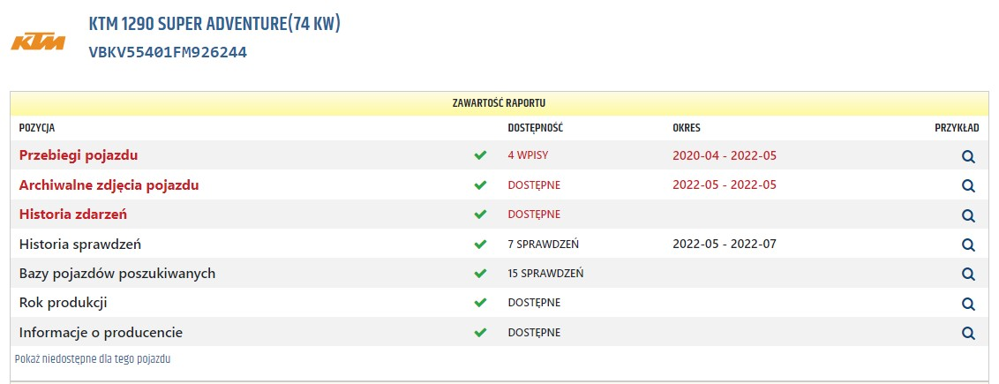

Na pierwszym ekranie został poprawnie zdekodowany VIN na plus dla auotbazy, że podali po samym numerze model motocykla - 1290 Super Adventure 74 kw.

Tak jak w carVertical i w przeciwieństwie do cepik, wystarczy numer vin motocykla, żeby sprawdzić jego historię.

<h3>Ile kosztuje raport?</h3>

Tu ceny są zmienne i dynamiczne, zależą od tego co znajdziesz w raporcie. Stan na 21.07 to <strong>69,90 zł dla sprawdzanego KTM</strong>, nie mamy też pakietów ale mamy bon rabatowy, który możecie kupić za symboliczną złotówkę. Uprawnia on do <strong>30% rabatu</strong>, na kolejne raporty przez <strong>30 dni</strong>. Porównując do konkurenta wychodzi nieco drożej - tam przy zakupie 2 raportów rabat wynosił 39% ale nie wiedzieliśmy co mamy w raporcie. W autobazie zapłacisz za rzeczywiste dane. <strong>Yamaha MT-09 kosztuje 57,40 zł</strong>, ale nie ma informacji o zdjęciach, przebiegi dotyczą lat 2020-05 - 2021-05 i była sprawdzana aż 15 razy.

Dodatkowo Polacy mają w ofercie raport z Belgii dla KTM, Yamaha nie ma dodatkowego raportu z Francji.

Oba mają możliwość kupna wyceny za 5 zł oraz sprawdzenie zastawu sądowego za złotych 60.

Zastaw sądowy to kredyt zaciągnięty na motocykl. Niby duży koszt ale tysiące złotych zostaje w kieszeni jeżeli okaże się, że pojazd jest obciążony i kupisz go z ukrytym dodatkowym zobowiązaniem.

Wybieram wariant podstawowy i zajrzyjmy do  historii pojazdu KTM.

<h3>Raport KTM 1290</h3>

Trochę inny wygląd ale informacje podobne, na początku mamy podgląd sprawdzanego VIN i kilka kafelków podsumowania, od razu widzimy, że przebieg jest ok, nie był kradziony ale mamy uszkodzenia.

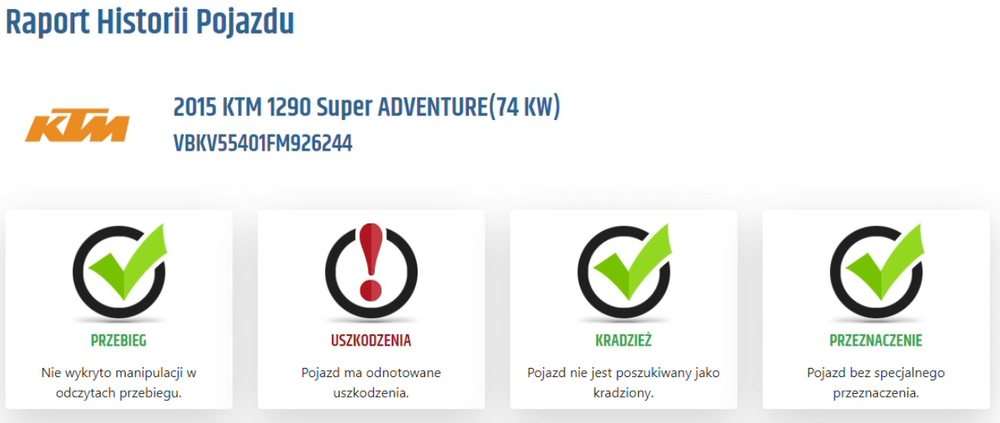

<h4>Informacje o pojeździe</h4>

Trochę więcej szczegółów dotyczących pojazdu, podano nam, że silnik ma 1301 cm3, konkretny model z 74kw, które jednak nieco dalej przy mocy silnika zostały zamienione na 747 kW. Ciekawa jest moc 1002 HP - konie mechaniczne? Oj strach odpalać.

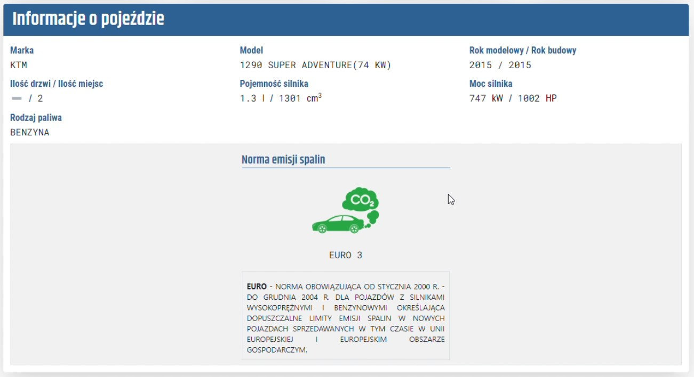

Mamy też normę emisji spalin, przydatna informacja w nawiązaniu do parlamentu europejskiego, który raz po raz wyskakuje z nowymi normami, strefami bez emisyjnymi i tak dalej. Niedługo może się okazać, że takim motocyklem Euro 3 jak w przypadku tego KTM nie wjedziecie do centrum miasta. Warto zwrócić na to uwagę.

<h4>Ewidencja pojazdów poszukiwanych</h4>

Tu czysto, autobaza chwali się, że sprawdza 15 baz ale niektóre dotyczą tych samych krajów, np. 3 z Polski. Nie wiem czy one się nie pokrywają i nie jest to sztuczka marketingowa.

<h4>Historia pojazdu - oś czasu</h4>

Mamy datę produkcji i wiek motocykla a następnie przechodzimy do długiej listy tego co działo się z naszym jednośladem. Kolorem czerwonym oznaczono uszkodzenia, wycena ich jest <strong>bardziej precyzyjna niż w przypadku carVertical</strong>, pierwsza szkoda z Belgii oszacowana została na 900 - 1000 euro.

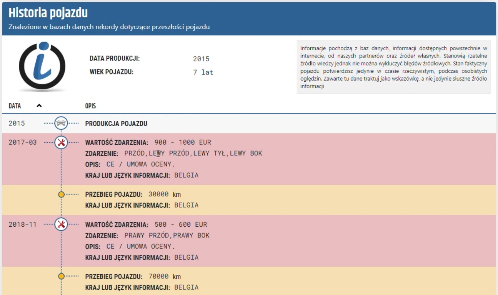

Pojawiły się odczyty licznika! Przy okazji szkody udało się je odnotować, widać, że w 2017 przy pierwszej stłuczce licznik wskazywał 30 000 km.

Kolejna również jest bardzo precyzyjnie wskazana 500 - 600 euro i 70 000 km na liczniku.

Na osi nie ma już zbyt wiele informacji poza kolejnymi kilkoma odczytami drogomierza.

<h4>Incydenty po numerze vin</h4>

Poniżej osi czasu znajdziecie wizualizacje, trzeba przyznać dość toporną motocykla z umiejscowieniem szkody. Nie czepiając się wyglądu spełnia swoją funkcję.

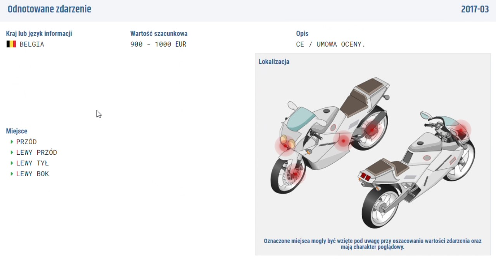

Podobne informacje są pokazane osobno dla każdego incydentu z udziałem motocykla.

<h4>Odczyty licznika</h4>

Wreszcie jest tak jak być powinno, nie mamy szacunków jak w przypadku carVertical ale rzeczywiste odczyty przebiegu. Mimo, że motocykl ma 7 lat. Dane dostępne są od pierwszej szkody - pewnie wtedy licznik został spisany przez ubezpieczyciela. 

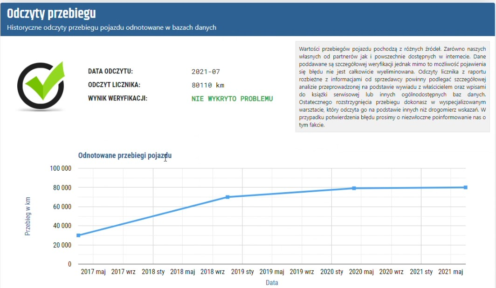

<h4>Wisienka na torcie - zdjecia</h4>

Raport KTM zawiera fotki oznaczone datą z maja 2022, pewnie wtedy motocykl był wystawiony na aukcji. Jest wśród nich również zdjęcie licznika, dodatków które pewnie oferował sprzedający. Dla mnie bomba.

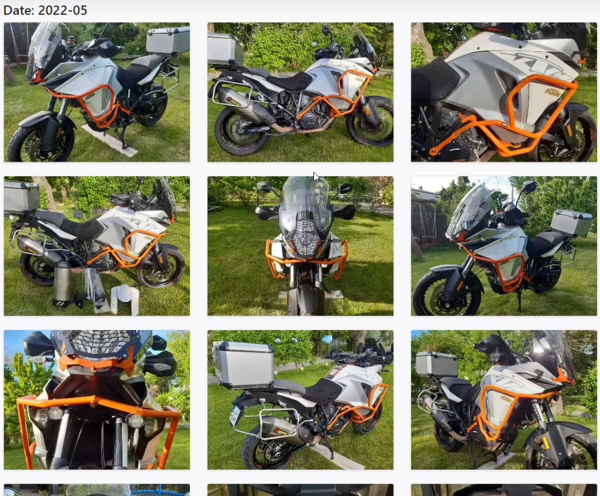

Szkoda tylko, że nie mamy zdjęć z wyceny szkód z Belgii, to byłaby miazga i gwóźdź do carVerticalowej trumny. Tak moim zdaniem autobaza wygrywa ale bez fajerwerków.

<h3>Co zawiera raport dot Yamahy Tracer 900</h3>

W początkowym podsumowaniu dostajemy 4 kafelki i tak jak poprzednik tylko uszkodzenia zwracają wykrzyknik.

Pozytywnie pokazały się dane dotyczące pojazdu, 0,8l i 847 cm3 zamienione na 79 kW / 107 KM. Serwis wskazał, że sprawdzony numer vin to model Tracer MT-09, <strong>mają </strong>pod tym względem <strong>zdecydowanie lepszy dekoder</strong>.

<h4>Oś czasu historii pojazdu</h4>

Tracer 09 ma tak samo jak KTM bardziej precyzyjnie wycenione szkody, widełki nie są tak duże i wynoszą 1250 - 2000 eur dla pierwszego wypadku i 5000 - 7500 eur dla drugiego.

Oś czasu zawiera też <strong>konkretne wartości odczytu licznika</strong>, bez żadnych szacunków. Odczyty te są oznaczone wg kraju wiemy ile motor przejechał we Francji a ile w Polsce.

<h4>Odnotowane zdarzenia</h4>

Ten fragment wymaga poprawy miejsce wizualizacji motocykla zajął samochód, niby nie duży błąd ale powinni to poprawić skoro rozpoznali, że to Yamaha Tracer 900, to raczej nie auto...

To by było na tyle, przejdźmy do podsumowania.

<h2>Dlaczego warto sprawdzić vin?</h2> 

Jako kupujący musimy maksymalnie się zabezpieczyć szczególnie biorąc pod uwagę zakup motocykla używanego. Obydwa sprawdzone przeze mnie motory pochodziły z importu, nie ma co wierzyć na słowo handlarzowi. On zawsze będzie chciał maksymalizować swój zysk. Nie wiem jak wygląda kręcenie liczników jednośladów, wiem, że w samochodach to była plaga. Teraz przepisy się zmieniły i jest to w Polsce przynajmniej karalne, ale co stoi na przeszkodzie przekręcić go zanim zjedzie do nas?

To samo dotyczy ukrytych uszkodzeń. Spoko motocykl miał parkingówkę, pogieły się gmole, wydech przytarł robiąc to z ubezpieczenia serwis sprawdzający historię pojazdu ma info o tej szkodzie i będziesz widział w raporcie czy jej wartość to 1000 eur czy 12 000 eur. 

Oczywiście może być tak, że ktoś naprawia na swój koszt bez zgłaszania wtedy raporty będą puste.

Pokazanie wyniku takie kontroli vin podczas oględzin, już na miejscu to dobre narzędzie na nieuczciwych sprzedawców, łatwo wyjaśnić człowieka który mówi, że był bezwypadkową igiełką.

<h2>Czego mi zabrakło?</h2> 

Historia serwisowa, to jak regularnie był serwisowany, wymiana oleju itp, oraz planu serwisowego, rozpiski co i za ile będę musiał wymieniać. Kupując używany motor bez książki serwisowej mogę tego nie wiedzieć, że szykuje się naprawa która pociągnie z kieszeni sporo kasy.

Fajnie jakbym wiedział o liczbie właścicieli, oba motocykle z zagranicy, który z kolei będę ja? Motocykl z jednym właścicielem łatwiej sprzedać a z 3 i importowany?

Wycena, autobaza co prawda oferuje ją za dodatkowe 5 zł ale czy mają dane?

<h2>Opinia o autobaza</h2> 

Uczciwa firma, która oferuje to co widać za adekwatne do tego pieniądze, mają więcej danych, chociaż ich prezentacja zachwyca, widać, że strona była robiona jakiś czas temu i wymaga odświeżenia.

<h2>Opinia o carVertical</h2> 
Dużo w tym produkcie marketingu, zamieniają brak danych na plus mówiąc, że to dobrze, że czegoś nie wykryli, chociaż tak naprawdę trudno mi w to uwierzyć, raczej stawiam, że nie mają danych. Nie dowiesz się co w środku dopóki nie zapłacisz. Co prawda piszą, że 100% gwarancji zwrotu, ale to firma z Litwy, nie sprawdzałem jak wygląda obsługa klienta i czy to prawda. Mniej danych ale marketingowo lepiej opakowane co może się podobać.

<h2>carVertical czy autobaza gdzie sprawdzić vin aby poznać historię motocykla?</h2> 
Z którego serwisu skorzystać? Krótko? Sprawdź na <a target="_blank" rel="noopener noreferrer" href="https://www.autobaza.pl/partner/id/80000467">autobaza.pl</a> dlaczego? Dowiesz się ile kosztuje naprawdę ten raport i jakie dane mają. <a target="_blank" rel="noopener noreferrer" href="https://www.carvertical.com/pl/landing/sheras">carVertical</a> ma stałą cenę i nie powiedzą Ci zanim nie zapłacisz co będzie w środku. Warto jednak wiedzieć i nie kupować kota w worku. Powiesz, że na autobazie jest drożej? ok ale mają lepsze dane, są jak widziałeś powyżej zdjęcia, nie jest ich wiele ale są, nie wykluczone, że dla Twojego motocykla będą wcześniejsze niż z ostatniej aukcji.

Autobaza ma dane dotyczące odczytów licznika, carVertical tylko je szacuje.
