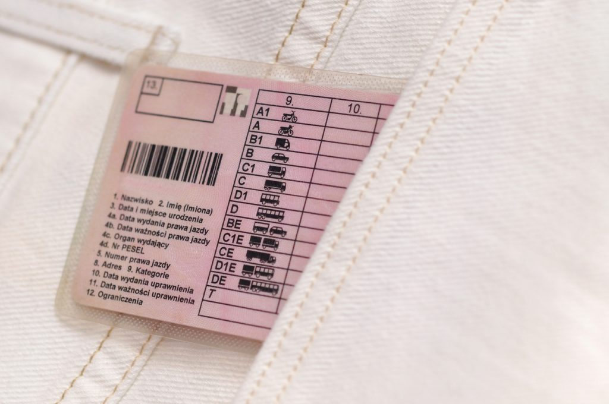

Coraz więcej osób decyduje się na zdobycie takich uprawnień. Co należy wiedzieć na temat karty rowerowej? Jaka jest jej cena i od kiedy można ją wyrobić? Poznajcie nasze kompendium wiedzy na ten temat.

## Karta motorowerowa - podstawowe informacje 
Obecnie karta motorowerowa nazywana jest kategorią AM. Jednak nieoficjalna jazda nadal jest w użyciu. Kiedyś egzaminy były przeprowadzane pod koniec szkoły podstawowej bądź w szkołach zawodowych. 
Zdobycie uprawnień ówcześnie nie było bardzo trudne. Obecnie sytuacja nieco się zmieniła i **egzaminy na kartę motorowerową** przeprowadzane są w Wojewódzkich Ośrodkach Ruchu Drogowego. Konieczne jest zdanie **części teoretycznej** i praktycznej. Jak się okazuje wcale nie jest to łatwe. O ile przed 19 stycznia **2013 r.** uczniowie zdawali egzamin na kartę motorowerową, tak po tym czasie jej rolę pełni **prawo jazdy kategorii AM**. 
Warto tutaj zauważyć, iż w latach ubiegłych jej zdanie było łatwiejsze, gdyż odbywało się pod okiem nauczyciela.          

## Karta motorowerowa - od ilu lat?
Wbrew pozorom **nie trzeba być pełnoletnim**, by uzyskać uprawnienia prawa jazdy kat. AM. Wystarczy ukończenie **14 roku życia**. Oczywiście trzeba pamiętać, że jeżeli osoba zdająca egzamin jest niepełnoletnia, to jej opiekun prawny musi wydać zgodę. Oczywiście trzeba też pamiętać o założeniu w wydziale komunikacji profilu kandydata na kierowcę. Dodatkowo podczas badań lekarskich, ale i zdawania egzaminu musi być opiekun prawny osoby, która nie ma ukończonych 18 lat.     

## Ile kosztuje karta motorowerowa i jakie wymagania formalne trzeba spełnić? 
Nim przejdziemy do tego, by przedstawić Wam, ile kosztuje egzamin i sam kurs, dowiecie się najpierw o wymaganiach formalnych, które trzeba spełnić, by zdobyć uprawnienia do **kierowania motorowerem. Czterokołowcami lekkimi** nazywamy motorowery i skutery o pojemności silnika nieprzekraczającej 50 cm3. Aby uzyskać uprawnienia do ich prowadzenia, **należy mieć ukończone minimum 14 lat**. W przypadku osób niepełnoletnich konieczne jest uzyskanie zgody rodzica. Dodatkowo należy uzyskać orzeczenie lekarskie o braku przeciwwskazań, a więc kandydata czeka m.in. badanie wzroku i słuchu. 

W kolejnym etapie należy udać się do wydziału komunikacji w urzędzie miejskim bądź gminnym, a następnie wyrobić profil kandydata na kierowcę w wydziale komunikacji (PKK). Pozostaje już tylko ukończenie kursu , a także zdanie egzaminu państwowego. 

> Karta motorowerowa, a może prawko kategorii A? [Wszystko co musisz wiedzieć o PKK](/porady/pkk-profil-kandydata-na-kierowce-jak-wyrobic-pytania-i-odpowiedzi/)

Przypominamy, że badania lekarskie osób niepełnoletnich odbywają się w obecności opiekuna prawnego. Zdobycie uprawnień do prowadzenia motorowerów **wymaga ukończenia kursu**, którego **koszt to ok. 1000 zł**. Orzeczenie lekarskie kosztuje średnio **od 100 do 200 zł**. Oczywiście to jeszcze nie koniec wydatków, jakie będzie ponosić osoba starająca się o prawo jazdy kategorii AM. Cena egzaminu teoretycznego i praktycznego to koszt **170 zł**. Po zdaniu egzaminów czeka Was jeszcze koszt wyrobienia samego dokumentu, który wynosi **100,50 zł**.            

## Karta motorowerowa - cena i przepisy prawne 
Jak zauważyliście cena karty motorowerowej nie jest niska. **Minimum wyniesie Was 1300 zł** i to pod warunkiem, że zdacie egzaminy za pierwszym razem. W innym przypadku trzeba będzie ponieść większe koszty związane z powtórnymi egzaminami. Także **cena badań lekarza** orzecznika w dużej mierze zależy od samego lekarza, przy czym zazwyczaj ceny są wyższe w większych miastach i to nawet **od 100 do 150 zł**. 

Kategoria AM wymaga znajomości przepisów o ruchu drogowym, jednak test teoretyczny jest łatwiejszy niż w przypadku kat. B, gdyż kursant ma do wyboru odpowiedzi "tak" lub "nie", a nie test wielokrotnego wyboru.

W wybranej szkole jazdy kandydat ujawnia dane osobowe, w skład których wchodzi numer **[profilu kandydata na kierowcę (PKK)](https://mototrips.pl/trening/pkk-profil-kandydata-na-kierowce/)** oraz jego numer PESEL. 
Czas trwania szkolenia do kategorii AM jest ustalany przez instruktora w porozumieniu z kursantem, przy czym ten czas nie może być krótszy niż 10 godzin, co dotyczy zarówno szkolenia teoretycznego, jak i szkolenia praktycznego. Jedna godzina szkolenia teoretycznego jest równa 45 minutom, zaś jedna godzina szkolenia praktycznego jest równa 60 minutom zajęć. 

Dodatkowo szkolenie może trwać dłużej, jeżeli szkoleniowiec uzna, że potrzebne są dodatkowe lekcje, natomiast **sam kurs na kategorię prawa jazdy AM nie może trwać dłużej niż 20 godzin**. Dopiero po ukończeniu kursu można zdawać egzamin. Szkolenie teoretyczne zawsze odbywa się w ośrodku szkolenia kierowców. 

Zajęcia prowadzone są przez instruktora nauki jazdy bądź kierowcę. Po ukończeniu części teoretycznej kandydaci muszą rozpocząć szkolenie praktyczne, które obejmuje ćwiczenia na placu manewrowym, a także w ruchu miejskim. Przed ukończeniem szkolenia konieczne jest zdanie egzaminu wewnętrznego. Brak pozytywnego wyniku egzaminu wewnętrznego może skutkować wydłużeniem czasu trwania szkolenia podstawowego. Z części teoretycznej szkolenia zwolnione są osoby, które samodzielnie przygotowały się do egzaminu teoretycznego i zdały go w Wojewódzkim Ośrodku Ruchu Drogowego.             

## Karta motorowerowa - wiek uprawniający do zapisania się na kurs i jej zdobycia
Wraz z wejściem w życie przepisów od dnia 19 stycznia 2013 r. z przepisów znika pojęcie karty motorowerowej, przy czym posiadacze takich kart wydanych przed tą datą nadal zachowują swoje uprawnienia. Aktualnie wymagany minimalny wiek, by zyskać uprawniania do prowadzenia motorowerów i czterokołowców lekkich wynosi 14 lat, przy czym szkolenie dziecko za zgodą opiekuna może rozpocząć szkolenie szybciej, jednak nie wcześniej niż 3 miesiące przed osiągnięciem minimalnego wieku.      

## Od ilu lat jest karta motorowerowa? Jakie zmiany od marca 2022 i jak przygotować się do egzaminu praktycznego? 
Osoba egzaminowana podczas egzaminu musi zweryfikować swoją tożsamość, a więc posiadać dowód osobisty, paszport, a w przypadku osób niepełnoletnich legitymację szkolną. Przed przystąpieniem do egzaminy trzeba podać numer PKK i PESEL. Na początek przeprowadzany jest egzamin teoretyczny. Kandydat odpowiada na 20 pytań z wiedzy podstawowej i 12 z wiedzy specjalistycznej. Wszystkie pytania nowego egzaminu obowiązującego od marca 2022 r. dotyczą bezpieczeństwa ruchu drogowego i mają jedną prawidłową odpowiedź. Rozwiązywanie zadań polega na wyborze prawidłowej odpowiedzi i wskazanie jej na ekranie komputera we właściwym polu. 

### Egzamin praktyczny na kategorię AM
Do zdania egzaminu praktycznego potrzebny będzie specjalny strój. Prowadzenie motorowerów możliwe jest przy zachowaniu odpowiednich środków bezpieczeństwa. Ośrodek egzaminacyjny udostępnia kamizelkę, kask oraz ochraniacze na kolana i łokcie. We własnym zakresie należy wyposażyć się w:
- obuwie na płaskiej podeszwie,
- spodnie z długimi nogawkami,
- kurtkę z długimi rękawami zapinaną na suwak, guziki lub zatrzaski,
- rękawice zakrywające całe dłonie.

Pierwsza część egzaminu praktycznego rozpoczyna się od sprawdzenia stanu technicznego pojazdu i przygotowania go do jazdy. Kursant może zostać poproszony o sprawdzenie poziomu oleju w silniku, działania świateł, czy stanu łańcucha. Potem należy wykonać kilka manewrów na placu. Po zalczeniu zadań odbywa się jazda w ruchu miejskim, która trwa minimum 10 minut, po wyznaczonej trasie, którą wcześniej ogłasza dany ośrodek WORD. Po zdaniu egzaminu otrzymuje się uprawnienia do kierowania pojazdów kat. AM, czyli motorowerów i czterokołowców lekkich.

Jeśli kupujesz motorower z zagranicy może Ci się przydać:
[Dokumenty potrzebne do rejestracji](/porady/dokumenty-potrzebne-do-rejestracji-motocykla-z-zagranicy/)