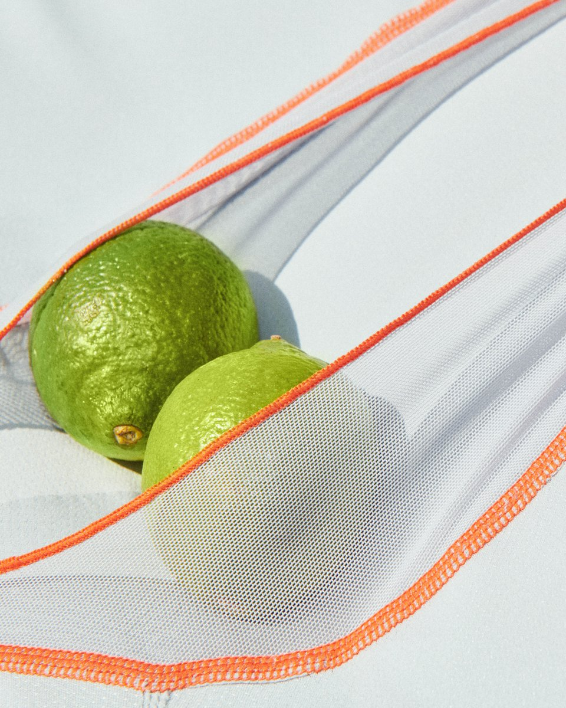
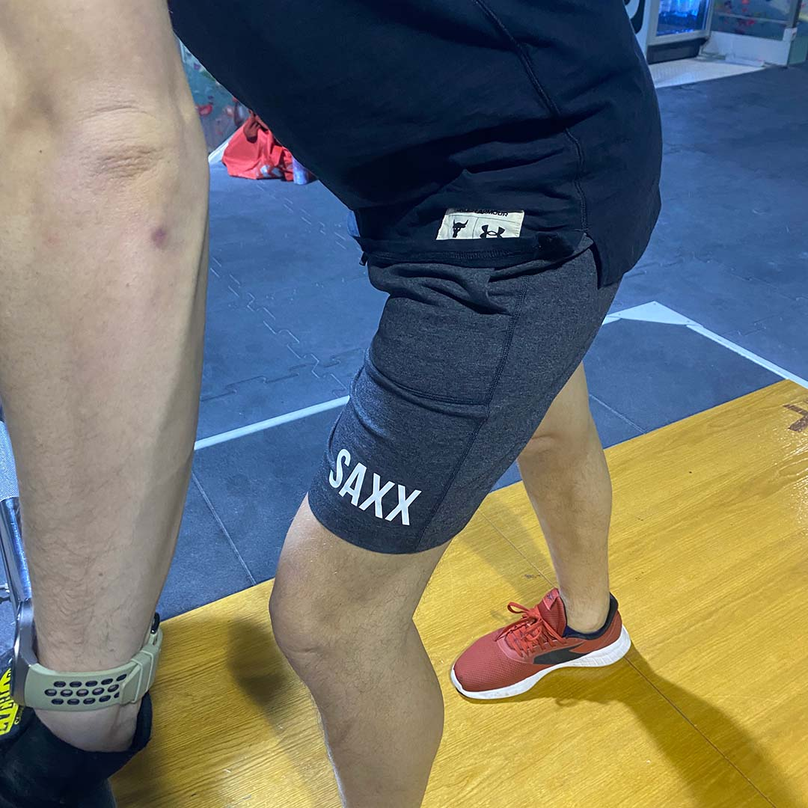

## Bielizna męska na motocykl Saxx Underwear®
Wiecie, jaki jest największy ból związany z bielizną dla mężczyzn? Jest niewygodna. Każdy mężczyzna, który ceni sobie komfortową i wysokojakościową bieliznę, powinien zaopatrzeć się w produkty Saxx. Podczas jazdy motocyklem odpowiedzialny za skupienie mózg zwiększa swoją aktywność, wzrasta czujność i spada podatność na rozpraszanie się. Znacie to uczucie, w kombinezonie gorąco, wbijacie bieg, składacie się w zakręt, wolność... Same pozytywne emocje, aż tu nagle totalny dyskomfort w miejscu intymnym. Nie chcemy mieć w takich momentach niepotrzebnych odwracaczy uwagi. Co zrobić, żeby nie narazić się na otarcia, czy uciski? Wybrać bieliznę Saxx! Powiem wprost, ile razy zdarzyło mi się, że jajka wypadły mi z jednej strony nogawki bielizny, a ona sama podwinęła się do góry, zrolowała i wkurza. 

Bez ingerencji manualnej nie da się wyjść z tej sytuacji. Trzeba to poprawić...

Założę się, że podobnych sytuacji doświadczył kiedyś każdy facet. Najbardziej irytujące jest to w momentach, w których nie możesz nic z tym zrobić. Weź tu zdejmij kombinezon, rozpinaj wszystko. No nie ma jak…

Założyciel marki Saxx doświadczał tego typu utrapień i postanowił znaleźć rozwiązanie. SAXX Underwear® to bielizna zaprojektowana od podstaw przez człowieka, który znał problem i zaprojektował bieliznę dla mężczyzn na nowo. Tak powstał BallPark Pouch™. Cała technologia jest taka, że nie ociera, nie przesuwa się i trzyma wszystko właśnie tam, gdzie powinno być, NA MIEJSCU! Zresztą zobaczcie sami na tej prostej wizualizacji.

Do tej pory nie spotkałem się z tego rodzaju udoskonaleniem tej podstawowej najbardziej nam bliskiej części garderoby. Cały patent polega na dodaniu odpowiednich wstawek materiału tak, by powstał odpowiedni parking na jajka wyżej wspomniany BallPark Pouch™. Patent od Saxx jest prosty i zarazem genialny, jak to często bywa, te dwa pojęcia chodzą w parze. Jak widać, a właściwie nie widać od zewnątrz bielizna nie różni się niczym szczególnym. Wewnątrz jednak zastosowano panele odgradzające uda od nabiału. Posiadanie tych „grodzi" sprawia, że od tej pory rodzaje męskiej bielizny możemy podzielić na Saxx - synonim poukładania i wygody, oraz całą resztę.

## Dlaczego bokserki Saxx kinetic są tak wygodne?
Powodów jest kilka, jednym z nich jest zastosowany krój. Wspomniana technologia trzymająca narządy płciowe na swoim miejscu to patent stosowany we wszystkich rodzajach odzieży tej marki.  Płaskie szwy i ich ulokowanie na zewnętrznej stronie skutkuje brakiem jakichkolwiek podrażnień, odciśnięć i otarć. Wewnętrzna część jest gładka i w pełni komfortowa. Prawie ich nie czuć, pozostają niewidoczne pod ubraniem. Największa zaleta? - TOTALNY KOMFORT!!! 
Niezależnie od tego, czy parę godzin latacie na ulubionym motocyklu po leśnych szutrach, czy roztapiacie się w upalny dzień w miejskiej dżungli. Każdy rodzaj aktywności może liczyć na odpowiednie wsparcie, poprzez zastosowanie odpowiednich tkanin i kroju dopasowanego do wymagań użytkownika. Ciśnie mi się tu porównanie do tych damskich ze skrzydełkami. To mniej więcej tu mamy męski odpowiednik skrzydełek, ale i nie tylko... 

Mówimy o upale? Saxxy odpowiadają, mamy na to DropTemp ™ - to rozwiązanie, które wspomaga chłodzenie i odprowadzanie potu. Rewelacja zwiększająca naturalną zdolność chłodzenia organizmu poprzez zastosowanie tkaniny, która jest jak mikro sitko. Skóra łatwiej oddycha. Bielizna szybko schnie, a wytrzymałość pozwala na szybkie przepranie. 

Następny element to patent zwany Threee-D Fit™. Aż dziewięć zszytych paneli materiału opina główne grupy mięśni. Jak aktywnie byście nie spędzali czasu, one dotrzymają wam i waszym jajkom kroku. Nic wam się nie marszczy, nie podwija i nie ucieka. Zakładacie je i są tam, gdzie być powinny być.

**Generalnie linii produktów o wyspecjalizowanych cechach jest dużo:**
- DAYTRIPPER
- QUEST
- CANNONBALL
- HOT SHOT
- HYPERDRIVE
- KINETIC
- OH BUOY
- PILOT
- QUEST
- SPORTMESH
- ULTRA
- UNDERCOVER
- VIBE
- VOLT

Wszystkie znajdziecie na stronie [meskarzecz.com](https://bit.ly/3wDQhX8)

## Saxx to nie tylko bielizna do testów dostaliśmy również szorty
Świetnie sprawdzą się we wszelkiego rodzaju aktywnościach fizycznych. Testowałem je i na siłowni i ściance wspinaczkowej. Bardzo dobry materiał przyjemny w dotyku, są rozciągliwe i szybkoschnące.

## Opinia o bieliźnie Saxx Underwear®
Miałem okazję przetestować je w możliwie najgorszych warunkach. Całodniowa jazda motocyklem w terenie daje w kość każdemu rodzajowi ubrania. Recenzja bielizny dla motocyklisty marki Saxx nie była jednak uciążliwa. Patent **BallPark Pouch** po prostu działa. Trzyma wasze jajka na miejscu, nic nie wypada nogawkami, bokserki nie podciągają się do góry, nie marszczą. Jest tak, jak obiecuje producent.

Drugim miejscem testów był trening wspinaczkowy. Zakładanie uprzęży dynamiczne ruchy, to sprawia, że wiele majtek „nie ogarnia” tematu. Często niekomfortowo trzeba włożyć sobie rękę w spodenki i poprawić tu i tam.

Trzy godziny treningu na ściance wspinaczkowej udowodniły mi, że ten rodzaj bielizny to świetny wybór.
Jeśli macie z tym problem, bo zamiast skupić się na ulubionej aktywności, musicie poprawiać galotki, to bielizna od Saxx spełni wasze oczekiwania. Moje spełniła w 100%. Zdecydowanie produkt warty swej ceny.

Zachęcam do odkrycia pozostałych produktów tej kolorowej marki.
Produkty tej marki kupicie pod tym linkiem:
<a className="button" href="https://bit.ly/3wDQhX8">Sprawdź Saxx</a>

