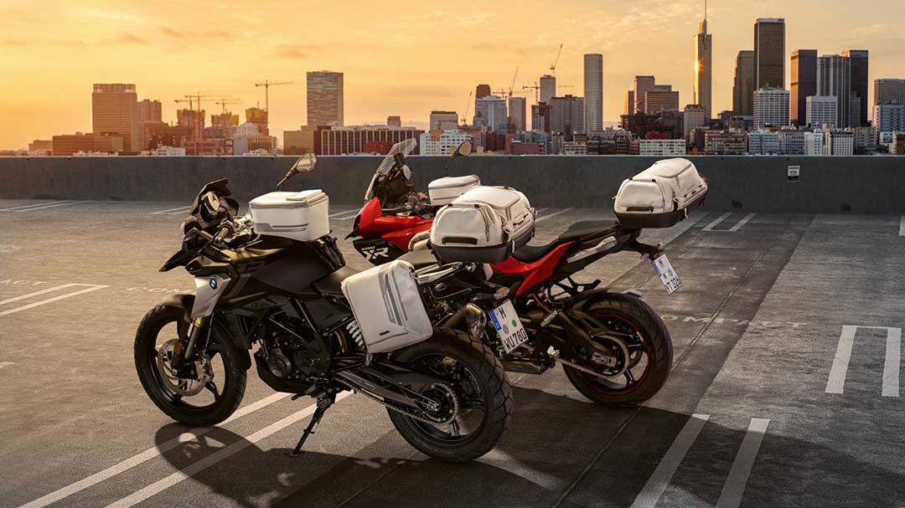
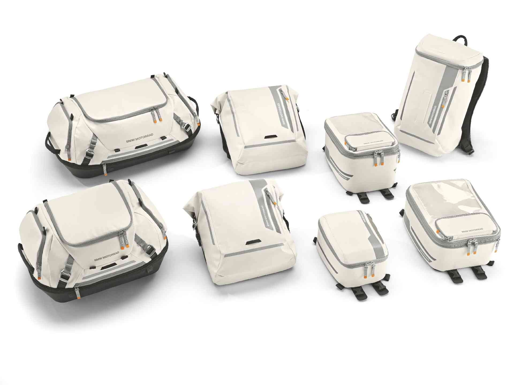
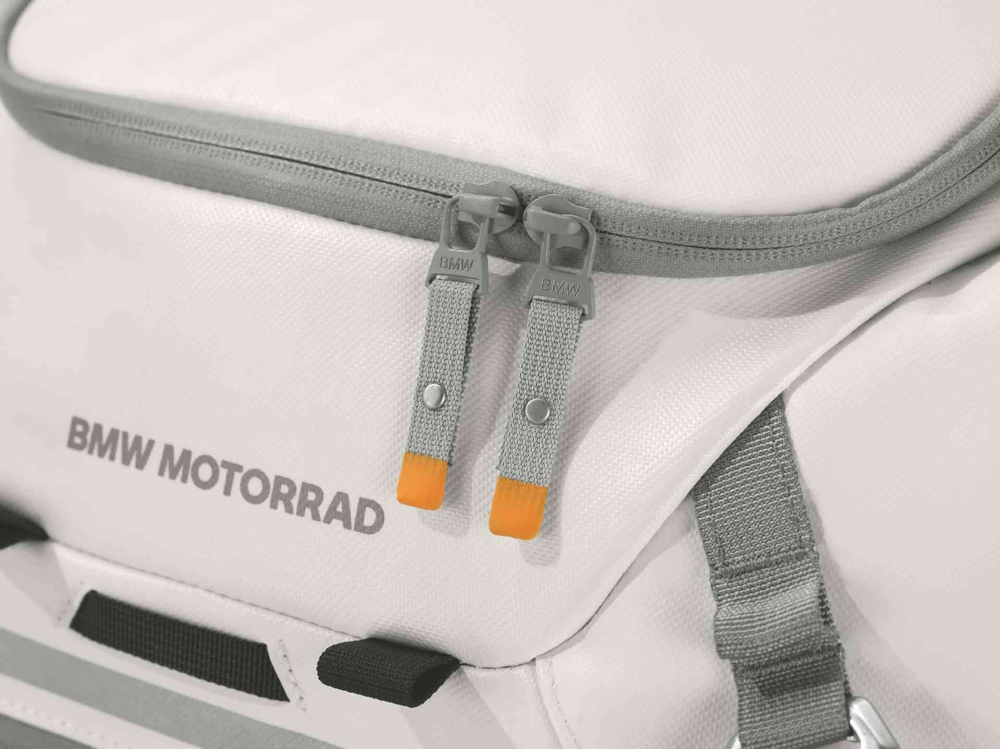
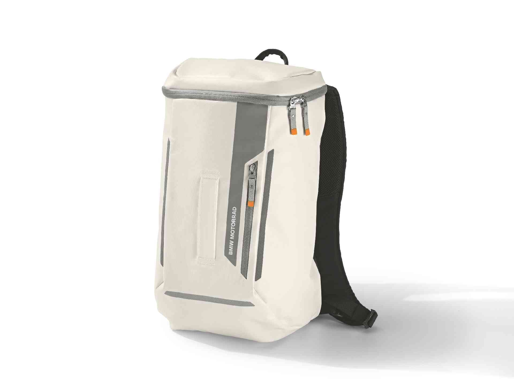
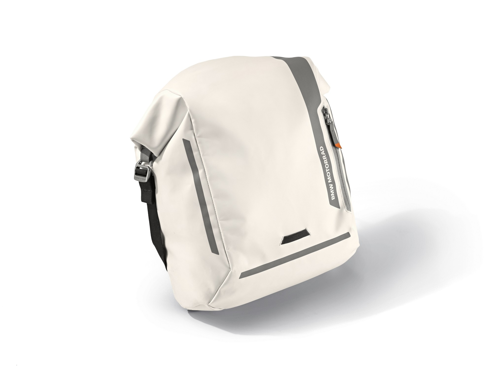
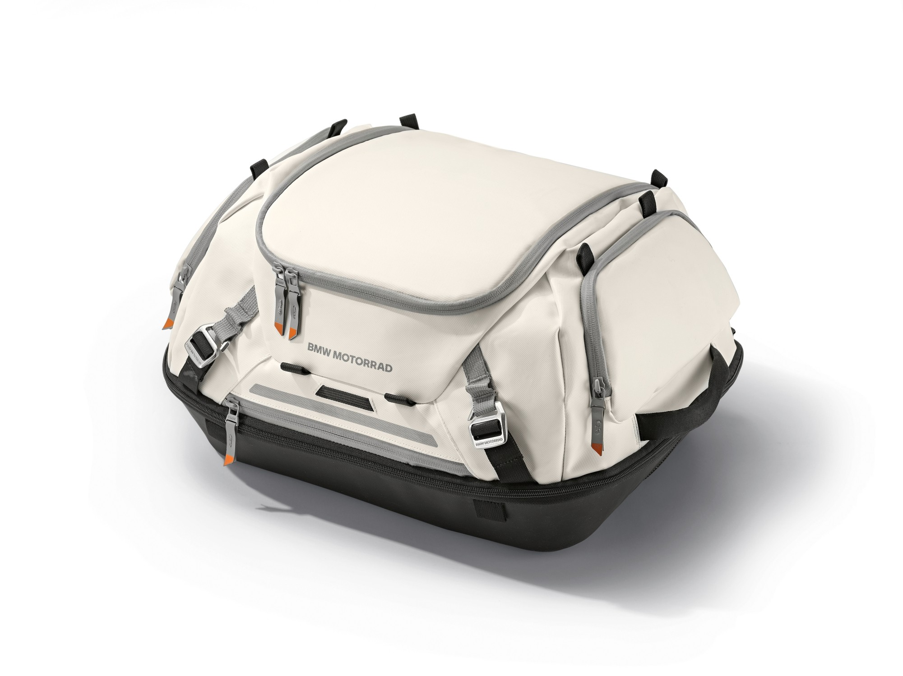
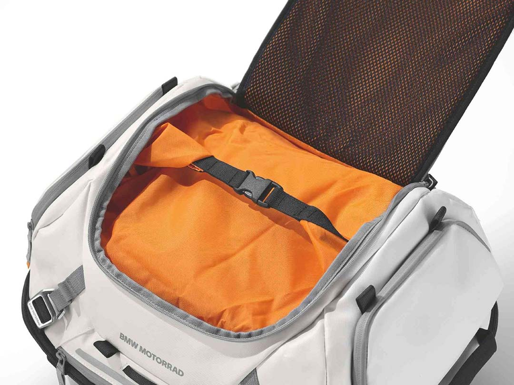
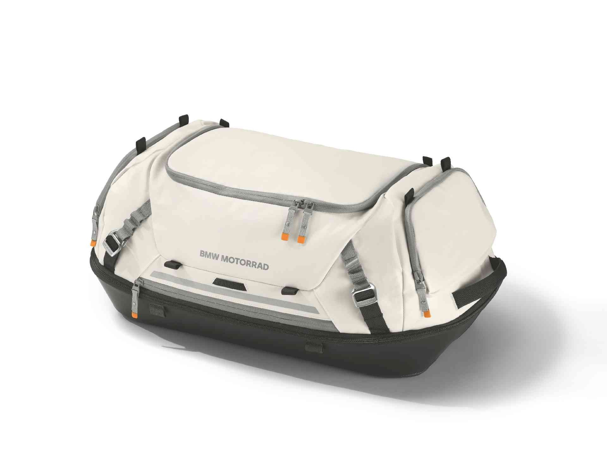

Wraz z nową kolekcją miejską (urban collection) BMW Motorrad prezentuje kolejną generację toreb na bak, plecaków oraz toreb bocznych i tylnych, obok istniejącej już kolekcji czarnej. Wykonane z wysokiej jakości materiałów łatwych w pielęgnacji (materiał zewnętrzny 100% PA z powłoką TPU, podszewka 100% PES), łączą wysoką trwałość i funkcjonalność z atrakcyjnym wzornictwem.

## Torby na zbiornik z kolekcji Urban

Trzy nowe torby na zbiornik z kolekcji Urban, dostępne w różnych rozmiarach i kształtach, spełniają niemal wszystkie wymagania motocyklistów. Torba na zbiornik **Urban Collection Large (GS)** (11 - 16 litrów) została zaprojektowana specjalnie dla motocykli o stromo nachylonym kształcie zbiornika, natomiast torba na zbiornik **Urban Collection Large** (11 - 16 litrów) została opracowana dla motocykli o półokrągłym kształcie zbiornika.
Tank Bag **Urban Collection Small** (5 litrów) stanowi trzeci wariant, gdy nie potrzeba tak wiele miejsca.

Dzięki antypoślizgowej wyściółce z pianki na spodzie i paskowi mocującemu torby na bak, które są wyposażone w wyjmowane wodoodporne torby wewnętrzne, można je łatwo i pewnie zamocować. Zatrzaski z przodu i z tyłu ułatwiają także tankowanie. Zaczepy można również przymocować do bagażnika lub siedzenia pasażera.

Wszystkie torby na bak są wyposażone w wodoodporny i zamykany dwukierunkowy zamek błyskawiczny w komorze głównej, zamykaną na zamek błyskawiczny kieszeń w pokrywie, otwór na kabel do ładowania od wewnątrz oraz kolorową wyściółkę wewnętrzną dla lepszej widoczności.

Tankbagi **Urban Collection Large** / (GS) oferują również wodoodporną, przezroczystą komorę z możliwością dotyku. Dla łatwej obsługi ekranów smartfonów czy tabletów. Do wszystkich trzech modeli dostępne są oddzielne mocowania do pasów motocyklowych.

## Plecak Urban Collection

Plecak Urban Collection o pojemności 20 litrów jest idealnym towarzyszem jednodniowych wycieczek lub podróży do pracy i posiada wiele praktycznych funkcji. Wodoodporna komora główna z wodoszczelnym, gumowanym dwukierunkowym zamkiem błyskawicznym jest wyposażona w **przegrodę na laptopa** (do 15''). Dwie zewnętrzne kieszenie oferują praktyczną przestrzeń do przechowywania rzeczy, które muszą być szybko pod ręką. Wewnętrzna kieszeń z siatki, kolorowa podszewka zapewniająca lepszą widoczność, uchwyt do przenoszenia oraz regulowane paski na ramię, klatkę piersiową i biodro dopełniają szeregu funkcji. Odblaskowe paski zapewniają lepszą widoczność.

## Sakwy motocyklowe BMW Urban Collection

**Torby boczne Urban Collection Large** (16 litrów) i **Urban Collection Small** (10 litrów) oferują wodoodporną komorę główną, pojemność, którą można regulować za pomocą pasków kompresyjnych, oraz paski odblaskowe poprawiające widoczność.

Dzięki pomysłowemu systemowi szybkiego odpinania torbę boczną Urban Collection Large można przymocować do motocykla bez pasków. Ponadto jest wyposażona w wodoodporną i wyjmowaną torbę wewnętrzną, w której znajduje się:

- wyściełana przegroda na laptopa 15",
- uchwyt na klucze,
- przegroda na smartfon,
- siatkowa przegroda na bidon
- oraz przegroda zapinana na zamek błyskawiczny.

Dzięki stylowemu wzornictwu, chowanym rączkom i dużemu uchwytowi do noszenia, torby tylne Urban Collection Large i Urban Collection Small zawsze dobrze się prezentują, nawet po zejściu z motocykla.

Główna komora jest wyłożona kolorową podszewką i dzięki dużemu otworowi może pomieścić nawet kask, a regulowane paski z klamrami zapewniają bezpieczne trzymanie się na motorze.

Szczególnie warto zwrócić uwagę na zamek błyskawiczny umożliwiający **zwiększenie pojemności** z 50 do 60 litrów lub z 37 do 45 litrów.

