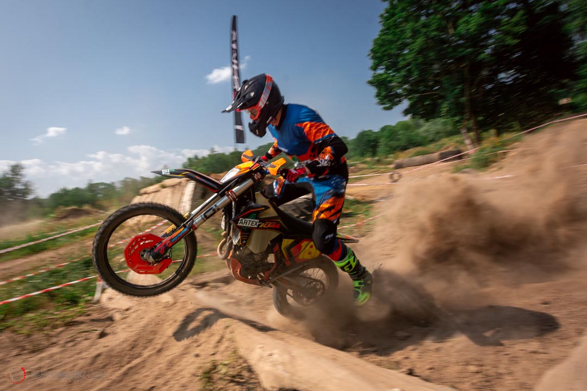

## Ale zacznijmy od początku - trochę teorii w tym temacie też się przyda

### Co to jest orteza?
Zgodnie z nomenklaturą medyczną to **aparat ortopedyczny**, którego głównym zadaniem jest **usztywnienie, stabilizacja czyli ograniczenie ruchomości wybranego stawu lub części ciała**. Taka orteza odciąża uszkodzony staw oraz zabezpiecza go przed kolejnym urazem czy przeciążeniem. Dodatkowym atutem jest zmniejszanie obrzęków pourazowych jak i przyspieszenie powrotu do pełnej aktywności, innymi słowy stosowanie takiej ortezy znacząco skraca proces rekonwalescencji. W sportach ekstremalnych niejednokrotnie służy do **zabezpieczania stawów przed kontuzjami**, ale o tym w dalszej części artykułu.

### Jakie są rodzaje ortez?
Na rynku medycznym dostępnych jest bardzo dużo różnych rodzajów ortez w zależności od oczekiwanego stopnia stabilizacji danej kończyny lub okolicy ciała. Wyróżnić można trzy główne rodzaje: 
1.	sztywne
2.	półsztywne (półelastyczne)
3.	elastyczne

## Orteza sztywna
Przykładowo dla stawu kolanowego **orteza sztywna to inaczej orteza z regulowanym kątem zgięcia (orteza zegarowa)**.Taki rodzaj ortezy stosuje się przy uszkodzeniach więzadeł krzyżowych, pobocznych, po operacjach m.in. rzepki, łąkotki czy po innych urazach wymagających ograniczenia ruchomości stawu kolanowego. Orteza ta ma teleskopowe szyny pozwalające na dopasowanie się do kształtu 
i długości nogi, precyzyjny zegar umożliwiający zablokowanie jej pod wymaganym kątem.
>Uwaga 
O tym tylko i wyłącznie powinien decydować specjalista, w tym przypadku fizjoterapeuta lub ortopeda. 

Dodatkowo taka orteza, dzięki wyposażeniu jej w taśmy mocujące jest łatwo wkładana, do jej zalet zaliczyć też można uniwersalność – pasuje zarówno na prawą jak i na lewą nogę.

## Orteza półsztywna
Staw kolanowy zabezpieczyć można również ortezą półsztywną, która **pełni funkcję głównie profilaktyczną przed ponownym odnowieniem kontuzji**. To swoiste wzmocnienie stawu podczas wykonywanej aktywności fizycznej poprzez jego stabilizację. Taka orteza ma zastosowanie przy lekkich uszkodzeniach więzadeł typu naciągnięcia i naderwania w ich obrębie, urazach torebki stawowej czy tkanek miękkich tej okolicy. Orteza półelastyczna znajduje swoje zastosowanie również w leczeniu zachowawczym czy przy chorobach zwyrodnieniowych.
### Jak wygląda orteza półsztywna?
To elastyczny rękaw ze wszytymi stabilizującymi szynami. Wyróżnić tu warto **ortezy otwarte**, które w swojej górnej i dolnej części są zapinane i regulowane rzepami. Taki stabilizator charakteryzuje się wysoką przepuszczalnością powietrza i zapobiega gromadzeniu się wilgoci.
## Ortezy elastyczne
Najczęściej są używane przez sportowców lub osoby uprawiające aktywności fizyczne w jednostkach treningowych zbliżonych zawodowym sportowcom. **Orteza ta jest stosowana profilaktycznie w celu zapobiegania przeciążeń, przy lekkich urazach, zwyrodnieniach stawu czy skręceniach**. Zapewnia ona delikatną kompresję wybranego stawu co powoduje jego stabilizację. Ortezy elastyczne zapewniają komfort przy jednoczesnym minimalnym odciążeniu, ustabilizowaniu stawu. Na rynku znajdziemy do wyboru opaski bezszwowe, ściągacze (wykonane z nylonu, lycry) czy stabilizatory siatkowe wyposażone w samoprzylepne taśmy.

## Podział ortez ze względu na zastosowanie części ciała
Z uwagi na okolicę części ciała/stawu/więzadła do której orteza ma zastosowanie wyróżnić można:
- **ortezy kończyn górnych** (dłoni, stawu łokciowego, stawu barkowego) - ortezy dłoni znajdują zastosowanie przy urazach nadgarstków czy przy problemach z cieśnią nadgarstka. Ortezy stawu łokciowego to przede wszystkim zabezpieczenie stawu przy najczęstszych urazach typu łokieć tenisisty, łokieć golfisty. Ortezy stawu barkowego stabilizują okolicę po urazach, operacjach jak i rozmaitych przeciążeniach więzadeł czy ścięgien.
- **ortezy kończyn dolnych** (stawu skokowego w tym głównie dot. urazów ścięgna Achillesa, stawu kolanowego, stawu biodrowego) - ortezy stawu skokowego stabilizują staw po wszelkiego rodzaju złamaniach, zwichnięciach czy skręceniach, dodatkowo są używane przy urazach ścięgna Achillesa, bądź różnego rodzaju zmianach zwyrodnieniowych tej części ciała. Ortezy stawu kolanowego są stosowane do odciążenia przy nadwyrężonych stawach kolan, zmianach zwyrodnieniowych tej okolicy, po operacjach bądź profilaktycznie do zabezpieczenia zdrowego stawu przed uszkodzeniem podczas uprawiania sportów narażających tą okolicę ciała na uszkodzenie. Takim sportem, w którym stabilizatory stawu kolanowego są bardzo popularne, a wręcz wymagane to jazdy motocrossowe po nierównym terenie, gdzie sytuacji przy których dochodzi do uszkodzenia stawu kolanowego może być bardzo dużo. Ortezy stawu biodrowego są stosowane m.in. po operacjach wymiany panewek biodrowych.
- **ortezy szyjnego odcinka kręgosłupa** - najbardziej popularny kołnierz ortopedyczny stabilizujący szyjne odcinek kręgosłupa po urazach, zabezpieczający przed wtórnymi uszkodzeniami tej okolicy.
- **ortezy piersiowego odcinka kręgosłupa** - to tak zwany gorset ortopedyczny, który odciąża tą okolicę kręgosłupa, zabezpiecza i stabilizuje po urazach żeber, obojczyka czy innych schorzeniach tej części kręgosłupa.
- **ortezy lędźwiowo-krzyżowego odcinka kręgosłupa**, najczęściej stosowane przy złamaniach kręgów lub schorzeniach degeneracyjnych kości typu osteoporoza.

## Ortezy, a jazda na motocyklach
Uszkodzenie rzepki, zerwanie więzadeł, przeprost, skręcenie, zwichnięcie to tylko część kontuzji jaka może nas czekać podejmując się jazdy offroadowej. Wiadomo motocross, enduro zapewnia nam skok adrenaliny, przygodę, emocje ale...kilka sekund nieuwagi, złapanie nierównej nawierzchni, wywrotka i skutki nienależytego zabezpieczenia stawów możemy odczuwać dość boleśnie nawet przez kolejnych parę miesięcy albo lat.

## Jak zminimalizować niebezpieczeństwo urazu stawów kolanowych?
Ale pamiętajmy, że nie tylko kolana trzeba chronić odpowiednie zabezpieczenie to podstawa i nie należy na tym oszczędzać. Dobór wysokiej jakości materiałów, z których będzie stworzony ochraniacz/orteza, a jednocześnie dbałość o wygodę podczas ruchu to minimum o jakim musimy pomyśleć. Im wyższej klasy użyte materiały tym bezpieczniej, wygodniej ale i drożej. Jednak, co jest bardzo istotne, w temacie zabezpieczenia warto wydać trochę więcej pieniędzy, aby ochrona była na dużo wyższym poziomie. Nie ma co ryzykować i liczyć na łut szczęścia.

## Ochraniacz na kolana, a orteza – co do czego służy
Ochraniacze zabezpieczają przed bezpośrednimi uderzeniami, ich koszt to mniej więcej 400 zł. Ortezy są bardziej rozbudowane, zabezpieczają dodatkowo przed przerostami, skręceniami, ich koszt potrafi sięgać kwoty 2000 zł albo i więcej.

## Ile kosztuje orteza dla motocyklisty i dlaczego tak drogo?
Zauważyliście tą zasadę jak ma być coś dobrze i fachowo to musi być drogo? W tym przypadku zasada ta również się potwierdza. Wydatek rzędu 2000 zł to niemały koszt dla budżetu, ale zapewniamy, warto go podjąć. Dlaczego? Porównując koszty ewentualnej rehabilitacji, operacji naprawczych uszkodzonego stawu kolanowego to wydatek 2000 zł nie wydaje się już tak duży. Kwestia odpowiedniego spojrzenia na temat.
Polecamy też drugą zasadę, która towarzyszy nam od długiego czasu nie tylko w temacie motocyklowym - lepiej zapobiegać, niż leczyć. 😊
