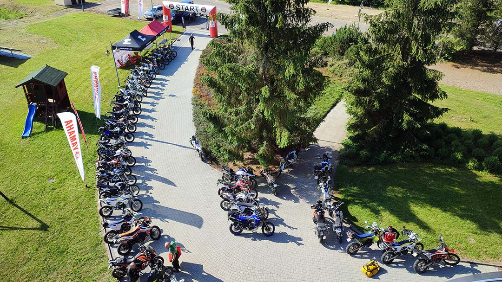

<iframe width="100%" height="315" src="https://www.youtube.com/embed/9kZ96qr3Nkg" title="YouTube video player" frameborder="0" allow="accelerometer; autoplay; clipboard-write; encrypted-media; gyroscope; picture-in-picture" allowfullscreen></iframe>

Przygoda zaczyna się od Prologu, odcinka który miał nam pokazać z czym to się je. Na miejscu nie było zaskoczenia, maszyny których się spodziewaliśmy czyli lekkie z dobrym bieżnikiem.

Z takich ciężkich krówek jak nasze było kilka [GSów dużych](https://mototrips.pl/moto-test/bmw-r-1250-gs-rocznik-2020-wersja-hp-recenzja-w-trasie/) ze dwa takie jak mój czyli F850, poza tym jedna starsza Afryka, jakiś KTM czy Triumph Tiger też się trafił ale w sumie, na 50-60 maszyn które startowały w tym rajdzie motocyklowym, tych ciężkich było może z 10. Z pewnością my byliśmy najmniej doświadczeni.

<i>Przegląd maszyn startujących w North South 2022 r.</i>

## Padnięci już na starcie
Nie dość, że w jeździe offroadowej nie mamy doświadczenia to tego typu długa trasa była pierwsza w tym roku
**Przejazd z Warszawy liczył ok 450 km** co dało nam w kość już na starcie, mieliśmy dosyć jazdy, a czekał nas pierwszy odcinek liczący ok 80 km, co nie oszukując się z naszymi umiejętnościami i zmęczeniem? Bite 2 h jazdy, a trzeba być skoncentrowanym, żeby nie położyć motocykla już pierwszego dnia.

Musicie wiedzieć, że swojego GSa po opóźnieniach udało mi się odebrać dopiero w maju! Czyli miesiąc miałem na oswojenie się z tą bestią - **250 kg**. Ledwo zdążyłem zrobić przegląd dotarcia i za dwa dni ruszam w pierwsządłuższą trasę.

1000 km na liczniku a ja biorę to cudeńko na taką katorgę. Na szczęście jest opcja zamówić motocykl z fabryki już na offroadowych oponach. Taki też do mnie przyjechał. Może słowo offroad jest tu trochę na wyrost. Opony Metzler Karoo 3 dobry bieżnik ale do zalecanej przez organizatora kostki mu daleko.

## Poniżej trasa rajdu
<iframe src="https://www.google.com/maps/d/u/0/embed?mid=1PmVKp2386NwS9xNGXy9LgUeuMoqHU2o&ehbc=2E312F" width="100%" height="480"></iframe>

## Jakie wrażenie po prologu?
Bieszczady są pięknę, zresztą już je opisywaliśmy na portalu [Bieszczady](/trasy-motocyklowe/polska/bieszczady/atrakcje-bieszczadow-z-punktu-widzenia-motocyklisty). Przejazd który normalnie odbywa się nocą zaczeliśmy w ostatniej chwili - start odbywał się do godziny 18. My przyjechaliśmy na sam koniec chwilę po 17, zdążyliśmy zostawić rzeczy w hotelu, coś na szybko przekąsić i musieliśmy ruszać.

Najciekawszy był przejazd **przez bród rzeczny** - mega, odcinek długi i bezpieczny, nie było ślisko i spokojnie przeprawiliśmy się przez niego choć kolega Afryka trochę wydygany - zobaczcie film pod koniec.
### Próba sprawnościowa - prolog
No i próba sprawnościowa. Gdyby nie była po całym dniu jazdu tobym nawet spróbował. Tak stwierdziłem, że szkoda mi motocykla, żeby go kłaść w te kamienie (co nadrobiliśmy 2 dnia rajdu, materiał wkrótce).
Na czym polegała i jak się przygotować na przyszłość?
Liczy się czas:
- startujesz na nogach przy beczce, gdzie musisz włączyć stoper
- lecisz do motocykla, odpalasz i jedziesz
- górka spoko, zjazd również
- trudne koleiny - to mogłoby zaskoczyć, żeby dobrze trafić
- meta - zeskakujsz z motocykla i wyłączasz stoper

Ta opcja z włączaniem i wyłączaniem stopera powtórzy się jeszcze ostatniego dnia rajdu, także warto przećwiczyć.

## Pro Tip roadbook w aplikacji Easy Rally
Nawigowanie podczas tak długiego rajdu z kartek to dodatkowe utrudnienie i strata czasu. Za namową nowo poznanych kolegów, co prawda dopiero ostatniego dnia ale zawsze zakupiłem aplikację [Easy Rally](https://play.google.com/store/apps/details?id=pl.easyrally.roadbook.pro&hl=pl), dzięki której wygodnie obsługujecie Roadbook na ekranie telefonu. O samej aplikacji innym razem.

Tyle tym razem, pozdrowienia i lewa górą.
Zostaw suba i włącz powiadomienia (dzwonek), żeby nie ominąć kolejnych filmów.

<button className="button"><a href="https://drive.google.com/file/d/1s6hLVYLcTwmeo86M-ge4yZZr7-WO_46_/view?usp=sharing">Pobierz w formacie GPX</a></button>